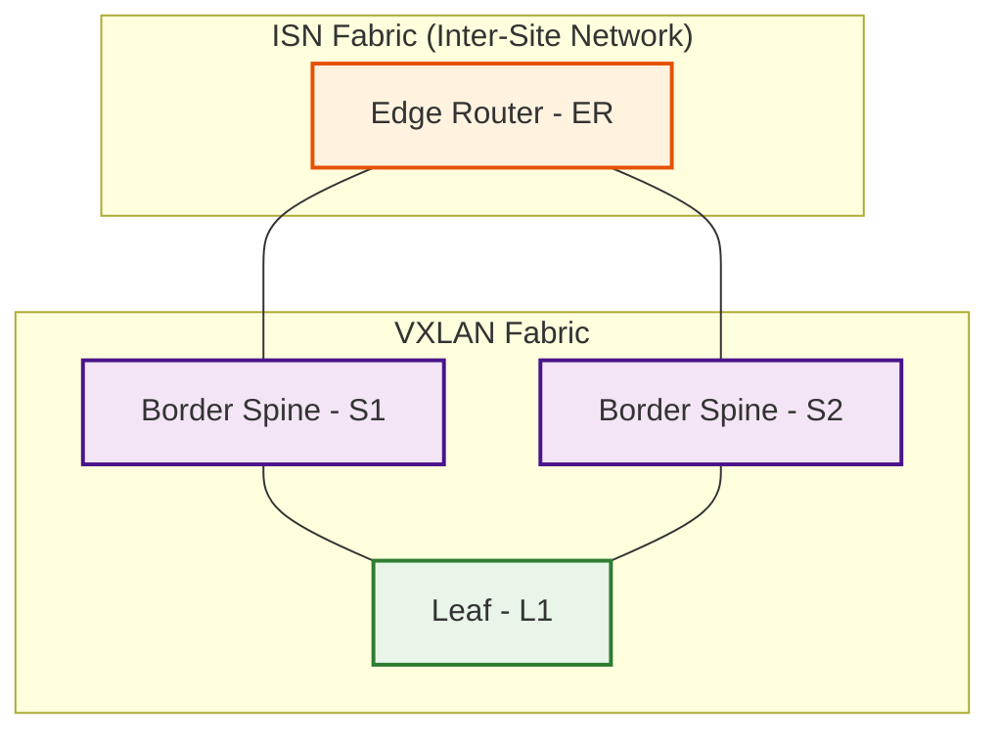

# Summary

Bringup a small VXLAN lab with Cisco Nexus Dashboard and Cisco Nexus9000v (n9kv) using QEMU.

## Cloning this Repository

```bash
git clone https://github.com/allenrobel/n9kv-kvm.git
```

## Topology

- Two fabrics
  - ISN (inter-site network)
    - 1x Edge Router (ER)
  - VXLAN (VxLAN)
    - 2x Border Spines (S1, S2)
    - 1x Leaf (L1)



## Project Structure

```bash
(n9kv-kvm) arobel@Allen-M4 n9kv-kvm % tree .
.
├── ansible
│   ├── dynamic_inventory.py
│   ├── interface_mac_addresses_ER.yaml
│   ├── interface_mac_addresses_L1.yaml
│   ├── interface_mac_addresses_S1.yaml
│   └── interface_mac_addresses_S2.yaml
├── bridges
│   ├── bridges_config.sh
│   ├── bridges_down.sh
│   └── bridges_monitor.sh
├── env
├── env_base.sh
├── main.py
├── pyproject.toml
├── qemu
│   ├── n9kv_qemu_ER.sh
│   ├── n9kv_qemu_L1.sh
│   ├── n9kv_qemu_S1.sh
│   └── n9kv_qemu_S2.sh
├── README.md
├── show_nd_interfaces
└── uv.lock

5 directories, 35 files
(n9kv-kvm) arobel@Allen-M4 n9kv-kvm %
```