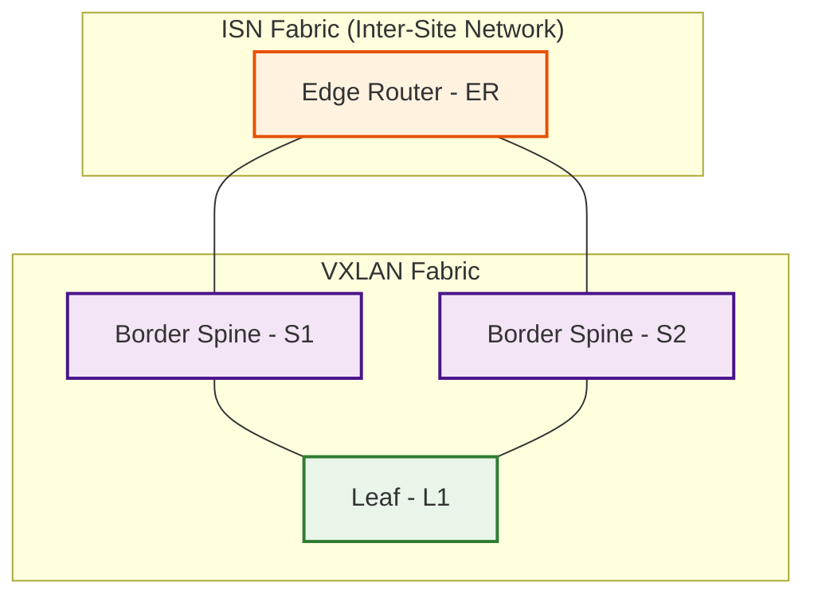

# Summary

Bringup a small VXLAN lab with Cisco Nexus Dashboard and Cisco Nexus9000v (n9kv)
using Ubuntu 24.04.2 LTS virtualization stack.

## Environment

This has been tested with the following.

- Cisco Nexus Dashboard
  - nd-dk9.3.2.1e.qcow2
- Cisco Nexus9000v
  - nexus9300v64.10.3.8.M.qcow2
- Ubuntu
  - 24.04.2 LTS
- Python
  - 3.13
  - The stock Python 3.12 on Ubuntu 24.04.2 LTS should also work
- Ansible
  - 2.18.7
- QEMU
  - qemu-system-x86_64 version 8.2.2

NOTE: You'll need a Cisco account to download Nexus Dashboard and Nexus9000v images.

## Dependencies

I use Python 3.13, but the stock Python 3.12 on Ubuntu 24.04.2 LTS should be fine.

To install Python 3.13, do the following.  Add the deadsnakes PPA.
This PPA contains more recent Python versions packaged for Ubuntu.

```bash
sudo add-apt-repository ppa:deadsnakes/ppa
sudo apt update

# Install Python 3.13
sudo apt install python3.13

# Install additional packages, especially python3.13-venv which we use further below
sudo apt install python3.13-venv python3.13-dev
```

You'll need the virtualization stack consisting of qemu and libvirt.
Install them as follows.

```bash
sudo apt update
sudo apt install qemu-kvm libvirt-daemon-system libvirt-clients bridge-utils virt-manager
```

If you don't want to run virsh and other virtualization commands as root, and you want
to run Virtual Machine Manager as a normal user (not root) add yourself to the libvirt
group.

```bash
# Run the following as a non-root user with sudo access.
sudo usermod -aG libvirt $USER
sudo usermod -aG kvm $USER
newgrp libvirt
sudo systemctl enable --now libvirtd
# Check if KVM is supported. If this returns error(s) things are not going to work for you.
kvm-ok

# Check libvirt status
sudo systemctl status libvirtd

# Assuming you've executed the above, you can run the virt-manager GUI (Virtual Machine Manager) as a normal user.
virt-manager
```

## Clone this Repository

The scripts and Environment vars in this Repository assume it is cloned into
the following location.  You can, of course, put it wherever you want, but
will need to update everything to match your preferred location.

```bash
$HOME/repos/n9kv-kvm
```

```bash
mkdir $HOME/repos
cd $HOME/repos
git clone https://github.com/allenrobel/n9kv-kvm.git
cd n9kv-kvm
```

## Create Python virtual environment in the repository and source it

```bash
cd $HOME/repos/n9kv-kvm
python3.13 -m venv .venv
source .venv/bin/activate
```

## Upgrade pip and install uv

```bash
pip install --upgrade pip
pip install uv
```

## uv sync to download dependencies used in this repository, including ansible

```bash
uv sync
```

## Test ansible-playbook to see if it's properly installed

```bash
ansible-playbook --version
whereis ansible-playbook # should be in $HOME/repos/n9kv-kvm/.venv/bin/ansible-playbook
```

## Topology built by this repository

- Two fabrics
  - ISN (inter-site network)
    - 1x Edge Router (ER)
  - VXLAN (VxLAN)
    - 2x Border Spines (S1, S2)
    - 1x Leaf (L1)



## Project Structure

```bash
(n9kv-kvm) arobel@Allen-M4 n9kv-kvm % tree .
.
├── config
│   ├── ansible
│   │   ├── dynamic_inventory.py
│   │   ├── interface_mac_addresses_ER.yaml
│   │   ├── interface_mac_addresses_L1.yaml
│   │   ├── interface_mac_addresses_S1.yaml
│   │   └── interface_mac_addresses_S2.yaml
│   ├── bridges
│   │   ├── bridges_config.sh
│   │   ├── bridges_down.sh
│   │   └── bridges_monitor.sh
│   └── qemu
│       ├── n9kv_qemu_ER.sh
│       ├── n9kv_qemu_L1.sh
│       ├── n9kv_qemu_S1.sh
│       ├── n9kv_qemu_S2.sh
│       ├── nd_qemu_321e.sh
│       └── nd_qemu_EFT.sh
├── env
│   ├── env_ansible.sh
│   ├── env_libvirt.sh
│   └── env_python.sh
├── monitor
│   └── show_nd_interfaces
├── pyproject.toml
├── README.md
└── uv.lock

7 directories, 21 files
(n9kv-kvm) arobel@Allen-M4 n9kv-kvm %
```
