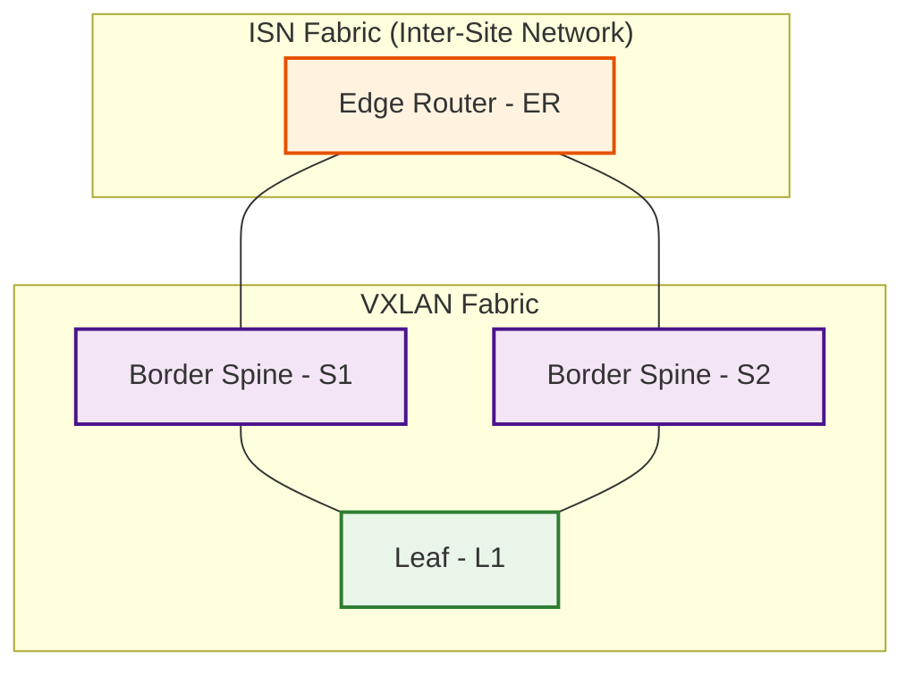

# Summary

Bringup a small VXLAN lab with Cisco Nexus Dashboard and Cisco Nexus9000v
(aka n9kv) using Ubuntu 24.04.2 LTS virtualization stack. [Topology](#topology-built-by-this-repository)

NOTE: You'll need a Cisco account to download Nexus Dashboard and Nexus9000v images.

## Hardware Requirements

- At least 500GB disk (preferrably 1TB)
- At least 256GB RAM (preferrably 512GB)

## Software Environment

This repository has been tested with the software versions listed below.

A note about the `Installation` links below.  Components should be installed
in the order they appear in this document since some components depend on
previously-installed components.  The intent of the `Installation` links
is twofold:

- Provide an overview of what lies ahead
- Provide easy reference access to specific sections after the project is up and running

It's assumed Ubuntu 24.04.2 LTS is already installed on hardware that
meets the [Hardware Requirements](#hardware-requirements) and on which
[KVM is supported](#kvm-support).

- [Cisco Nexus Dashboard](https://www.cisco.com/c/en/us/support/data-center-analytics/nexus-dashboard/series.html)
  - nd-dk9.3.2.1e.qcow2
  - [Installation](#nd-install-nexus-dashboard)
- [Cisco Nexus9000v](https://www.cisco.com/c/en/us/td/docs/dcn/nx-os/nexus9000/103x/n9000v-n9300v-9500v/cisco-nexus-9000v-9300v-9500v-guide-release-103x.html)
  - nexus9300v64.10.3.8.M.qcow2
  - [Installation](#nexus-9000v-configuration-and-startup)
- Ubuntu
  - [24.04.2 LTS](https://ubuntu.com/desktop)
- Python
  - [3.13.5](https://www.python.org/downloads/release/python-3135/)
  - The stock Python 3.12 on Ubuntu 24.04.2 LTS should also work
  - [Installation](#install-python-313)
- [Ansible](https://docs.ansible.com/ansible/latest/installation_guide/intro_installation.html#installing-and-upgrading-ansible-with-pip)
  - 2.18.7
  - [Installation](#upgrade-pip-and-install-uv)
- NDFC Ansible Collection
  - [Installation](./docs/install_ansible_collection.md)
- [QEMU](https://www.qemu.org)
  - qemu-system-x86_64 version 8.2.2
  - [Installation](#qemu-and-libvirt-virtualization-stack)
- [OVMF](https://wiki.ubuntu.com/UEFI/OVMF) (used for nk9v BIOS)
  - [Installation](#ovmf)
- [Cockpit](https://cockpit-project.org)
  - Optional (for monitoring n9kv VMs)
  - Version 343
  - [Installation (work in progress)](https://github.com/allenrobel/n9kv-kvm/tree/main/cockpit)
- [dnsmasq](https://wiki.debian.org/dnsmasq)
  - DNS server (for ND)
  - 2.90-2ubuntu0.1
  - [Installation](#dnsmasq-installation-and-configuration)
- [chrony](https://chrony-project.org)
  - NTP server (for ND)
  - chrony/noble-updates,now 4.5-1ubuntu4.2
  - [Installation](#chrony-installation-and-configuration)

## Dependencies

### KVM Support

Check if KVM is supported. If this returns error(s) things are not going to work for you.

```bash
sudo apt install cpu-checker
kvm-ok
```

### Install Python 3.13

I use Python 3.13, but the stock Python 3.12 on Ubuntu 24.04.2 LTS should be fine.

To install Python 3.13, do the following.  Add the deadsnakes PPA.
This PPA contains more recent Python versions packaged for Ubuntu.

```bash
sudo add-apt-repository ppa:deadsnakes/ppa
sudo apt update

# Install
sudo apt install python3.13

# Install additional packages, especially python3.13-venv which we use further below
sudo apt install python3.13-venv python3.13-dev
```

### QEMU and libvirt Virtualization Stack

You'll need the virtualization stack consisting of qemu and libvirt.
Install them as follows.

```bash
sudo apt update
sudo apt install qemu-kvm libvirt-daemon-system libvirt-clients bridge-utils virt-manager
```

If you don't want to run virsh and other virtualization commands as root, and you want
to run Virtual Machine Manager as a normal user (not root) add yourself to the libvirt
group.

```bash
# Run the following as a non-root user with sudo access.
sudo usermod -aG libvirt $USER
sudo usermod -aG kvm $USER
newgrp libvirt
sudo systemctl enable --now libvirtd

# Check libvirt status
sudo systemctl status libvirtd

# Assuming you've executed the above, you can run the virt-manager GUI (Virtual Machine Manager) as a normal user.
virt-manager
```

### OVMF

You'll need OVMF for the nexus9000v BIOS

```bash
sudo apt install ovmf
```

### Clone the n9kv-kvm repository

The scripts and environment vars in this repository assume it is cloned into
the following location.  You can, of course, put it wherever you want, but
will need to update everything to match your preferred location.

```bash
$HOME/repos/n9kv-kvm
```

```bash
mkdir $HOME/repos
cd $HOME/repos
git clone https://github.com/allenrobel/n9kv-kvm.git
cd n9kv-kvm
```

### Python virtual environment

So that this project's dependencies don't interfere with other projects,
it's recommended to create and activate a Python venv.

```bash
cd $HOME/repos/n9kv-kvm
python3.13 -m venv .venv
source $HOME/repos/n9kv-kvm/.venv/bin/activate
```

### Upgrade pip and install uv

```bash
source $HOME/repos/n9kv-kvm/.venv/bin/activate
pip install --upgrade pip
pip install uv
```

If you see a message similar to the below, check your PYTHONPATH and
ensure that `$HOME/repos/n9kv-kvm/.venv` is the first entry.

```bash
  Attempting uninstall: pip
    Found existing installation: pip 24.0
    Not uninstalling pip at /home/arobel/py311/lib/python3.11/site-packages, outside environment /home/arobel/repos/n9kv-kvm/.venv
    Can't uninstall 'pip'. No files were found to uninstall.

```

For example, PYTHONPATH should look like below (at least the first entry).

```bash
(.venv) arobel@cvd-3:~/repos/n9kv-kvm$ echo $PYTHONPATH
/home/arobel/repos/n9kv-kvm/.venv
(.venv) arobel@cvd-3:~/repos/n9kv-kvm$
```

If it doesn't, then do the following:

```bash
export PYTHONPATH=$HOME/repos/n9kv-kvm/.venv:$PYTHONPATH
# And try to upgrade pip and install uv again
source $HOME/repos/n9kv-kvm/.venv/bin/activate
pip install --upgrade pip
pip install uv
```

### uv dependency tree

When you run `uv sync` in the next section the following dependencies will be installed.

```bash
(n9kv-kvm) arobel@Allen-M4 n9kv-kvm % uv tree
Resolved 16 packages in 7ms
n9kv-kvm v0.1.0
├── ansible v11.8.0
│   └── ansible-core v2.18.7
│       ├── cryptography v45.0.5
│       │   └── cffi v1.17.1
│       │       └── pycparser v2.22
│       ├── jinja2 v3.1.6
│       │   └── markupsafe v3.0.2
│       ├── packaging v25.0
│       ├── pyyaml v6.0.2
│       └── resolvelib v1.0.1
└── requests v2.32.4
    ├── certifi v2025.7.14
    ├── charset-normalizer v3.4.2
    ├── idna v3.10
    └── urllib3 v2.5.0
(n9kv-kvm) arobel@Allen-M4 n9kv-kvm %
```

### uv sync

To install dependencies used in this repository, do the following.

```bash
source $HOME/repos/n9kv-kvm/.venv/bin/activate
cd $HOME/repos/n9kv-kvm
uv sync
```

### Test the environment

Test ansible-playbook to see if it's properly installed

```bash
source $HOME/repos/n9kv-kvm/.venv/bin/activate
ansible-playbook --version
# whereis should show $HOME/repos/n9kv-kvm/.venv/bin/ansible-playbook
whereis ansible-playbook
```

If ansible-playbook shows a different path, then your `PYTHONPATH` environment
variable contains a path to a different `ansible-playbook` that is overriding
the local installation path.  This may be OK if you prefer to use the other
version.  Else, modify your `PYTHONPATH` accordingly, e.g.:

```bash
unset PYTHONPATH
export PYTHONPATH=$HOME/repos/n9kv-kvm/.venv:$PYTHONPATH
```

### Install the NDFC Ansible Collection

We'll need this collection to run playbooks later that fix
nexus9000v inter-switch mac address issues.

Follow the steps outlined in
[Install NDFC Ansible Collection](./docs/install_ansible_collection.md)

### Setup Bridges

#### Configure qemu to allow the bridges used in this project

You may have to create the `/etc/qemu` directory first.

```bash
# Check if the directory exists
ls -ld /etc/qemu
# If it doesn't exist, create it.
sudo mkdir /etc/qemu
```

If `/etc/qemu/bridge.conf` already exists on your host, then append
the contents of `./config/bridges/bridge.conf` to your existing file.

```bash
# Check if /etc/qemu/bridge.conf exists
sudo cat /etc/qemu/bridge.conf
# If it does exist, append to it, rather than overwrite it.
sudo cat $HOME/repos/n9kv-kvm/config/bridges/bridge.conf >> /etc/qemu/bridge.conf
# Verify things look OK
sudo cat /etc/qemu/bridge.conf
```

It `/etc/qemu/bridge.conf` doesn't exist, create it.

```bash
sudo cp $HOME/repos/n9kv-kvm/config/bridges/bridge.conf /etc/qemu/bridge.conf
sudo chmod 600 /etc/qemu/bridge.conf
```

#### Configure netplan

Inspect and edit the following file to ensure it will work
for you.

```bash
$HOME/repos/n9kv-kvm/config/bridges/99-bridges.yaml
```

In particular, verify that:

- The physical interface exists. You'll likely need to change
  the interface name (`enp34s0f0` below) to match your host
  (see the `link` parameter for `Vlan11` and `Vlan12` below).
  To check your interfaces e.g. `ip link show`.
- Vlans 11 and 12 are not already associated with your
  interface (the `id` parameter for `Vlan11` and `Vlan12` below).
- The bridge names (e.g. `BR_ND_MGMT`, `BR_ER_S1`, etc) don't conflict
  with existing bridges on your host.
- The ip addresses (`192.168.11.1/24` and `192.168.12.1/24`) don't
  conflict with other addresses on your host, or with addresses in
  your network that your host needs to reach.

```yaml
  vlans:
    Vlan11:
      id: 11
      link: enp34s0f0
      optional: true
    Vlan12:
      id: 12
      link: enp34s0f0
      optional: true
```

Copy the bridges configuration into /etc/netplan.

```bash
cd $HOME/repos/n9kv-kvm/config/bridges
sudo cp ./99-bridges.yaml /etc/netplan
sudo chmod 600 /etc/netplan/99-bridges.yaml
```

Apply the bridges configuration

```bash
netplan try
netplan apply
```

The above commands might result in a warning similar to below.

```bash
** (process:37526): WARNING **: 18:03:28.923: Permissions for /etc/netplan/00-installer-config.yaml are too open. Netplan configuration should NOT be accessible by others.
```

If so, modify the permissions of the files in `/etc/netplan` as follows
and try to apply the bridges configuration again.

```bash
sudo chown root /etc/netplan/*
sudo chmod 600 /etc/netplan/*
```

If the above commands result in messages like the following, you can ignore them.

```bash
(.venv) arobel@cvd-3:~/repos/n9kv-kvm/config/bridges$ sudo netplan try
BR_ER_S2: reverting custom parameters for bridges and bonds is not supported
BR_ER_S1: reverting custom parameters for bridges and bonds is not supported
BR_ND_DATA: reverting custom parameters for bridges and bonds is not supported
BR_ND_MGMT: reverting custom parameters for bridges and bonds is not supported
BR_S2_L1: reverting custom parameters for bridges and bonds is not supported
br0: reverting custom parameters for bridges and bonds is not supported
BR_S1_L1: reverting custom parameters for bridges and bonds is not supported

Please carefully review the configuration and use 'netplan apply' directly.
```

Verify netplan was applied correctly.

- ip link show type bridge | grep BR_

Some bridges (e.g. `BR_ER_S1`) will show `state DOWN`. This is expected until we bringup,
the nexus9000v switches.

```bash
(.venv) arobel@cvd-3:~/repos/n9kv-kvm/config/bridges$ ip link show type bridge | grep BR_
10: BR_ER_S1: <NO-CARRIER,BROADCAST,MULTICAST,UP> mtu 9216 qdisc noqueue state DOWN mode DEFAULT group default qlen 1000
11: BR_ER_S2: <NO-CARRIER,BROADCAST,MULTICAST,UP> mtu 9216 qdisc noqueue state DOWN mode DEFAULT group default qlen 1000
12: BR_ND_DATA: <BROADCAST,MULTICAST,UP,LOWER_UP> mtu 1500 qdisc noqueue state UP mode DEFAULT group default qlen 1000
13: BR_ND_MGMT: <BROADCAST,MULTICAST,UP,LOWER_UP> mtu 1500 qdisc noqueue state UP mode DEFAULT group default qlen 1000
14: BR_S1_L1: <NO-CARRIER,BROADCAST,MULTICAST,UP> mtu 9216 qdisc noqueue state DOWN mode DEFAULT group default qlen 1000
15: BR_S2_L1: <NO-CARRIER,BROADCAST,MULTICAST,UP> mtu 9216 qdisc noqueue state DOWN mode DEFAULT group default qlen 1000
(.venv) arobel@cvd-3:~/repos/n9kv-kvm/config/bridges$
```

## dnsmasq Installation and Configuration

Follow the link below to install and configure `dnsmasq` for this project.

[Install, Configure, and Manage dnsmasq](./docs/dnsmasq.md)

## chrony Installation and Configuration

Follow the link below to install and configure `chrony` for this project.

[Install, Configure, and Manage chrony](./docs/chrony.md)

## ND Install Nexus Dashboard

Now that the servers we need are setup and running, let's install
Nexus Dashboard.

### ND - Things to be aware of

Before beginning, ND will ask you to connect with a web browser after
the initial CLI install is complete.  If you use a proxy server, make
sure that you configure your browser NOT to use the proxy server
for the ND address.  E.g. configure the `NO_PROXY` environment variable
(some apps may read this as lowercase, so best to configure both).

If you already have `NO_PROXY` configured, add 192.168.11.2 to your existing definition.

```bash
export NO_PROXY=192.168.11.2
export no_proxy=192.168.11.2
```

If you use Google Chrome, you can invoke it to not use a proxy (typically for
debugging when things aren't working as expected.)

```bash
google-chrome --no-proxy-server &
```

With that out of the way, let's get started.

### ND CLI based initial bringup

Follow the link below for initial CLI phase of the Nexus Dashboard bringup.

[ND Bringup - CLI Phase](./docs/nd_bringup_cli.md)

### ND 4.1 Browser based final bringup

Follow the link below for the final phase of the Nexus Dashboard 4.1 bringup.

[ND 4.1 Configuration Web Browser](./docs/nd4_bringup_web.md)

### ND 3.2 Browser based final brinup (TODO)

Follow the link below for the final phase of the Nexus Dashboard 3.2 bringup.

TODO...

### ND - Create ISN and VXLAN fabrics

#### ND 4.1 Fabrics Bringup

Follow the link below to bringup the fabrics under Nexus Dashboard 4.1 for this project.

[Fabrics Bringup, ND 4.1](./docs/nd4_fabrics_bringup.md)

#### ND 3.2 Fabrics Bringup

Follow the link below to bringup the fabrics under Nexus Dashboard 3.2 for this project.

[Fabrics Bringup, ND 3.2](./docs/nd3_fabrics_bringup.md)

## nexus9000v Initial Configuration and Bringup

Follow the link below to configure and bringup the nexus9000v VMs for this project.

[nexus9000v Configuration and Startup](./docs/n9kv_bringup.md)

## Add switches to ND

In ND, we've already created two fabrics, `ISN` and `VXLAN`.

Follow the following link to add switches to ND 4.1

[Add Switches, ND 4.1](./docs/nd4_add_switches.md)

Follow the following link to add switches to ND 3.2

[Add Switches, ND 3.2](./docs/nd3_add_switches.md)

## Fix duplicate mac addresses on interswitch-links

You'll notice that the nexus9000v switches are complaining about bridge
disputes, etc, on their Eth1/1-2 interaces, and they are unable to peer.

Follow this link to fix this.

[nexus9000v Fix Interface Mac Addresses](./docs/n9kv_fix_interface_mac_addresses.md)

## Topology built by this repository

- Two fabrics
  - ISN (inter-site network)
    - 1x Edge Router (ER)
  - VXLAN (VxLAN)
    - 2x Border Spines (S1, S2)
    - 1x Leaf (L1)



## Project Structure

```bash
(n9kv-kvm) arobel@Allen-M4 n9kv-kvm % tree
.
├── cockpit
│   ├── cockpit.png
│   ├── README.md
│   └── usr
│       ├── local
│       │   └── bin
│       │       ├── nexus9000v_monitor.py
│       │       ├── nexus9000v-monitor.service
│       │       ├── nexus9000v-monitor.timer
│       │       └── README.md
│       └── share
│           └── cockpit
│               └── nexus9000v
│                   ├── index.html
│                   ├── manifest.json
│                   ├── nexus-monitor-dark-theme.css
│                   ├── nexus-monitor-light-theme.css
│                   ├── nexus-monitor.css
│                   ├── nexus-monitor.js
│                   └── README.md
├── config
│   ├── ansible
│   │   ├── dynamic_inventory.py
│   │   ├── interface_mac_addresses_ER.yaml
│   │   ├── interface_mac_addresses_L1.yaml
│   │   ├── interface_mac_addresses_S1.yaml
│   │   ├── interface_mac_addresses_S2.yaml
│   │   ├── nxos_startup_config.j2
│   │   └── startup_config_iso.yaml
│   ├── bridges
│   │   ├── 99-bridges.yaml
│   │   ├── bridge.conf
│   │   ├── bridges_config.sh
│   │   ├── bridges_down.sh
│   │   └── bridges_monitor.sh
│   └── qemu
│       ├── n9kv_qemu_ER_cdrom.sh
│       ├── n9kv_qemu_ER.sh
│       ├── n9kv_qemu_L1.sh
│       ├── n9kv_qemu_S1.sh
│       ├── n9kv_qemu_S2.sh
│       ├── nd_qemu_321e.sh
│       └── nd_qemu_EFT.sh
├── docs
│   ├── chrony.md
│   ├── dnsmasq.md
│   ├── images
│   │   ├── nd4_1_journey.png
│   │   ├── nd4_10_cluster_install.png
│   │   ├── nd4_11_system_software.png
│   │   ├── nd4_12_release_details.png
│   │   ├── nd4_13_whats_new.png
│   │   ├── nd4_2_basic_information.png
│   │   ├── nd4_4_node_details_cluster_connectivity.png
│   │   ├── nd4_5_persistent_ips.png
│   │   ├── nd4_6_persistent_ips_added.png
│   │   ├── nd4_7_summary.png
│   │   ├── nd4_8_summary_error.png
│   │   └── nd4_9_login.png
│   ├── install_ansible_collection.md
│   ├── n9kv_bringup.md
│   ├── n9kv_fix_interface_mac_addresses.md
│   ├── nd_bringup_cli.md
│   ├── nd3_bringup_web.md
│   ├── nd4_bringup_web.md
│   └── nd4_fabrics_bringup.md
├── env
│   ├── env_ansible.sh
│   ├── env_libvirt.sh
│   └── env_python.sh
├── monitor
│   └── show_nd_interfaces
├── pyproject.toml
├── README.md
└── uv.lock

16 directories, 60 files
(n9kv-kvm) arobel@Allen-M4 n9kv-kvm %
```
