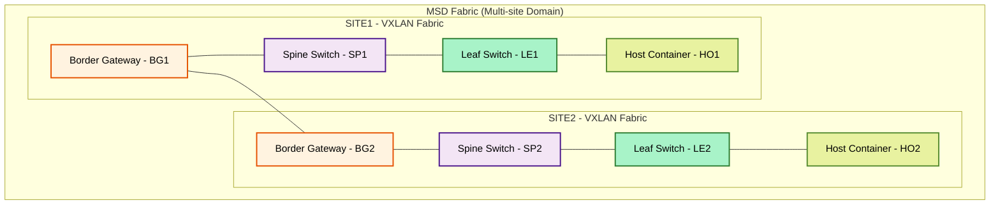

# Summary

Bringup a small multi-site VXLAN lab with Cisco Nexus Dashboard and Cisco Nexus9000v
(aka n9kv) using Ubuntu 24.04.2 LTS virtualization stack.

[Topology](#topology-built-by-this-repository)

NOTE: You'll need a Cisco account to download Nexus Dashboard and Nexus9000v images.

## Hardware Requirements

- At least 500GB disk (preferrably 1TB)
- At least 256GB RAM (preferrably 512GB)

## Software Environment

This repository has been tested with the software versions listed below.

A note about the `Installation` links below.  Components should be installed
in the order they appear in this document since some components depend on
previously-installed components.  The intent of the `Installation` links
is twofold:

- Provide an overview of what lies ahead
- Provide easy reference access to specific sections after the project is up and running

It's assumed Ubuntu 24.04.2 LTS is already installed on hardware that
meets the [Hardware Requirements](#hardware-requirements) and on which
[KVM is supported](#kvm-support).

- [Cisco Nexus Dashboard](https://www.cisco.com/c/en/us/support/data-center-analytics/nexus-dashboard/series.html)
  - nd-dk9.3.2.1e.qcow2
  - [Installation](./docs/nd_installation.md)
- [Cisco Nexus9000v](https://www.cisco.com/c/en/us/td/docs/dcn/nx-os/nexus9000/103x/n9000v-n9300v-9500v/cisco-nexus-9000v-9300v-9500v-guide-release-103x.html)
  - nexus9300v64.10.3.8.M.qcow2
  - nexus9500v64.10.5.3.F.qcow2
  - [Installation](./docs/n9kv_bringup.md)
- Ubuntu
  - [24.04.2 LTS](https://ubuntu.com/desktop)
- Python
  - [3.13.5](https://www.python.org/downloads/release/python-3135/)
  - The stock Python 3.12 on Ubuntu 24.04.2 LTS should also work
  - [Installation](#install-python-313)
- [Ansible](https://docs.ansible.com/ansible/latest/installation_guide/intro_installation.html#installing-and-upgrading-ansible-with-pip)
  - 2.18.7
  - [Installation](./docs/clone_prepare_repo.md)
- NDFC Ansible Collection
  - [Installation](./docs/install_ansible_collection.md)
- [QEMU](https://www.qemu.org)
  - qemu-system-x86_64 version 8.2.2
  - [Installation](#install-qemu-and-libvirt-virtualization-stack)
- [OVMF](https://wiki.ubuntu.com/UEFI/OVMF) (used for nk9v BIOS)
  - [Installation](#install-ovmf)
- [Cockpit](https://cockpit-project.org)
  - Optional (for monitoring n9kv VMs)
  - Version 343
  - [Installation (work in progress)](https://github.com/allenrobel/n9kv-kvm/tree/main/cockpit)
- [dnsmasq](https://wiki.debian.org/dnsmasq)
  - DNS server (for ND)
  - Optional (If a DNS server is already present in your environment)
  - 2.90-2ubuntu0.1
  - [Installation](#dnsmasq-installation-and-configuration)
- [chrony](https://chrony-project.org)
  - NTP server (for ND)
  - Optional (If an NTP server is already present in your environment)
  - chrony/noble-updates,now 4.5-1ubuntu4.2
  - [Installation](#chrony-installation-and-configuration)
- [debootstrap](https://launchpad.net/ubuntu/noble/amd64/debootstrap)
  - Create LXC host containers for end-to-end network testing hosts (H1 and H2 in the topology shown further below)
  - 1.0.134ubuntu1
- `libvirt-daemon-driver-lxc`
  - LXC support for libvirt for H1 and H2 network testing endpoint hosts
  - 10.0.0-2ubuntu8.8

## Install and Setup

We've arranged the steps below so that dependencies for later steps are met by earlier steps.
For best results, follow the steps below in order.

## KVM Support

Check if KVM is supported. If this returns error(s) things are not going to work for you.

```bash
sudo apt install cpu-checker
kvm-ok
```

## Install Python 3.13

I use Python 3.13, but the stock Python 3.12 on Ubuntu 24.04.2 LTS should be fine.

To install Python 3.13, do the following.  Add the deadsnakes PPA.
This PPA contains more recent Python versions packaged for Ubuntu.

```bash
sudo add-apt-repository ppa:deadsnakes/ppa
sudo apt update

# Install
sudo apt install python3.13

# Install additional packages, especially python3.13-venv which we use further below
sudo apt install python3.13-venv python3.13-dev
```

## Install QEMU and libvirt Virtualization Stack

You'll need the virtualization stack consisting of qemu and libvirt.
Install them as follows.

```bash
sudo apt update
sudo apt install qemu-kvm libvirt-daemon-system libvirt-clients bridge-utils virt-manager
```

If you don't want to run virsh and other virtualization commands as root, and you want
to run Virtual Machine Manager as a normal user (not root) add yourself to the libvirt
group.

```bash
# Run the following as a non-root user with sudo access.
sudo usermod -aG libvirt $USER
sudo usermod -aG kvm $USER
newgrp libvirt
sudo systemctl enable --now libvirtd

# Check libvirt status
sudo systemctl status libvirtd

# Assuming you've executed the above, you can run the virt-manager GUI (Virtual Machine Manager) as a normal user.
virt-manager
```

## Install OVMF

You'll need OVMF for the nexus9000v BIOS

```bash
sudo apt install ovmf
```

## Clone and Prepare the `n9kv-kvm` Repository

Follow the link below to clone this project's repository.

[Clone and Prepare Repository](./docs/clone_prepare_repo.md)

## Install the NDFC Ansible Collection

We'll need this collection to run playbooks later.

Follow the steps outlined in
[Install NDFC Ansible Collection](./docs/install_ansible_collection.md)

## Setup Bridges

Follow the link below to configure the bridges used for this project.

[Setup Bridges](./docs/bridges.md)

## dnsmasq Installation and Configuration

If you do not already have a DNS server in your environment, follow the link
below to install and configure `dnsmasq` for this project.

[Install, Configure, and Manage dnsmasq](./docs/dnsmasq.md)

## chrony Installation and Configuration

If you do not already have an NTP server in your environment, follow the link
below to install and configure `chrony` for this project.

[Install, Configure, and Manage chrony](./docs/chrony.md)

## Nexus Dashboard Installation

Follow the link below to install Nexus Dashboard.

[Install Nexus Dashboard](./docs/nd_installation.md)

## Create Nexus Dashboard Fabrics

Follow the link below to create the Nexus Dashboard fabrics used in this project.

[Create MSD, SITE1, and SITE2 Fabrics](./docs/nd_create_fabrics.md)

## nexus9000v Initial Configuration and Bringup

Follow the link below to configure and bringup the nexus9000v VMs for this project.

[nexus9000v Configuration and Startup](./docs/n9kv_bringup.md)

## Add nexus9000v Switches to Nexus Dashboard Fabrics

[Add nexus9000v Switches](./docs/nd_add_switches.md)

## Install libvert LXC Support

We are using LXC-style containers, running under libvirt, for network testing endpoint hosts.

Before running their creation scripts, we need to install LXC support for libvirt.

Follow this link to complete this step.

[libvirt LXC Driver Installation](./docs/install_libvirt_lxc_driver.md)

## Topology built by this repository

- Three fabrics
  - MSD (Multi Site Domain)
    - Contains both SITE1 and SITE2 fabrics
  - SITE1 (VxLAN)
    - 1x Border Gateway (BG1)
    - 1x Leaf (LE1)
    - 1x Host (HO1)
  - SITE2 (VxLAN)
    - 1x Border Gateway (BG2)
    - 1x Leaf (LE2)
    - 1x Host (HO2)



## Project Structure

```bash
(n9kv-kvm) arobel@Allen-M4 n9kv-kvm % tree -I venv -I .pycache
.
├── cockpit
│   ├── bridges
│   │   ├── README.md
│   │   └── usr
│   │       ├── local
│   │       │   └── bin
│   │       │       ├── bridge_monitor.py
│   │       │       ├── bridge-monitor.service
│   │       │       └── bridge-monitor.timer
│   │       └── share
│   │           └── cockpit
│   │               └── bridges
│   │                   ├── bridge-monitor-dark-theme.css
│   │                   ├── bridge-monitor-light-theme.css
│   │                   ├── bridge-monitor.css
│   │                   ├── bridge-monitor.js
│   │                   ├── index.html
│   │                   └── manifest.json
│   └── nexus9000v
│       ├── cockpit.png
│       ├── README.md
│       └── usr
│           ├── local
│           │   └── bin
│           │       ├── nexus9000v_monitor.py
│           │       ├── nexus9000v-monitor.service
│           │       ├── nexus9000v-monitor.timer
│           │       └── README.md
│           └── share
│               └── cockpit
│                   └── nexus9000v
│                       ├── index.html
│                       ├── manifest.json
│                       ├── nexus-monitor-dark-theme.css
│                       ├── nexus-monitor-light-theme.css
│                       ├── nexus-monitor.css
│                       ├── nexus-monitor.js
│                       └── README.md
├── config
│   ├── ansible
│   │   ├── dynamic_inventory.py
│   │   ├── interface_access_mode_LE1.yaml
│   │   ├── interface_access_mode_LE2.yaml
│   │   ├── networks_msd.yaml
│   │   ├── networks_site1.yaml
│   │   ├── networks_site2.yaml
│   │   ├── nxos_startup_config.j2
│   │   ├── overlay_site2.yaml
│   │   ├── site1_access_layer.yaml
│   │   ├── startup_config_iso.yaml
│   │   ├── vrfs_msd.yaml
│   │   ├── vrfs_site1.yaml
│   │   └── vrfs_site2.yaml
│   ├── bridges
│   │   ├── 99-bridges.yaml
│   │   ├── add_vlans_BR_L1_H1.sh
│   │   ├── add_vlans_BR_L2_H2.sh
│   │   ├── bridge.conf
│   │   ├── bridges_config.sh
│   │   ├── bridges_down.sh
│   │   ├── bridges_monitor.sh
│   │   ├── vlans_del_BR_L1_H1.sh
│   │   └── vlans_del_BR_L2_H2.sh
│   ├── containers
│   │   ├── __pycache__
│   │   │   ├── bridge.cpython-313.pyc
│   │   │   ├── config_generators.cpython-313.pyc
│   │   │   ├── config_loader.cpython-313.pyc
│   │   │   ├── executor.cpython-313.pyc
│   │   │   ├── factory.cpython-313.pyc
│   │   │   ├── filesystem.cpython-313.pyc
│   │   │   ├── interfaces.cpython-313.pyc
│   │   │   ├── libvirt_manager.cpython-313.pyc
│   │   │   ├── main.cpython-313.pyc
│   │   │   ├── models.cpython-313.pyc
│   │   │   ├── orchestrator.cpython-313.pyc
│   │   │   ├── packages.cpython-313.pyc
│   │   │   ├── requirements.cpython-313.pyc
│   │   │   └── rootfs.cpython-313.pyc
│   │   ├── bridge.py
│   │   ├── config_generators.py
│   │   ├── config_loader.py
│   │   ├── container_configs_access_mode.yaml
│   │   ├── container_configs_trunk_mode.yaml
│   │   ├── executor.py
│   │   ├── factory.py
│   │   ├── filesystem.py
│   │   ├── interfaces.py
│   │   ├── libvirt_manager.py
│   │   ├── main.py
│   │   ├── models.py
│   │   ├── orchestrator.py
│   │   ├── packages.py
│   │   ├── README.md
│   │   ├── requirements.py
│   │   ├── rootfs.py
│   │   └── setup.py
│   ├── nd
│   │   ├── nd_321e.sh
│   │   └── nd_411g.sh
│   └── nexus9000v
│       ├── BG1.yaml
│       ├── BG2.yaml
│       ├── CR1.yaml
│       ├── ER1.yaml
│       ├── global_config.yaml
│       ├── LE1.yaml
│       ├── LE2.yaml
│       ├── nexus9000v.py
│       ├── README.md
│       ├── SP1.yaml
│       └── SP2.yaml
├── docs
│   ├── bridges.md
│   ├── chrony.md
│   ├── clone_prepare_repo.md
│   ├── dnsmasq.md
│   ├── images
│   │   ├── nd3
│   │   │   ├── 01_cluster_bringup.png
│   │   │   ├── 02_node_details.png
│   │   │   ├── 03_edit_node.png
│   │   │   ├── 04_cluster_bringup.png
│   │   │   ├── 05_deployment_mode.png
│   │   │   ├── 06_external_service_ips.png
│   │   │   ├── 07_cluster_bringup.png
│   │   │   ├── 08_summary.png
│   │   │   ├── 09_warning.png
│   │   │   ├── 10_progress.png
│   │   │   ├── 11_login.png
│   │   │   ├── 12_progress.png
│   │   │   ├── 13_meet_nexus_dashboard.png
│   │   │   ├── 14_getting_started_map.png
│   │   │   └── add_switches
│   │   │       ├── 00_manage_inventory.png
│   │   │       ├── 01_inventory.png
│   │   │       ├── 02_pick_a_fabric.png
│   │   │       ├── 03_select_fabric.png
│   │   │       ├── 04_seed_switch_details.png
│   │   │       ├── 05_discovery_results.png
│   │   │       ├── 06_wait.png
│   │   │       ├── 07_wait.png
│   │   │       ├── 08_inventory.png
│   │   │       ├── 09_pick_a_fabric.png
│   │   │       ├── 10_select_fabric.png
│   │   │       ├── 11_seed_switch_details.png
│   │   │       ├── 12_warning_dialog.png
│   │   │       ├── 13_discovery_results.png
│   │   │       ├── 14_switches_reboot.png
│   │   │       ├── 15_wait_for_switch_added.png
│   │   │       ├── 16_add_switches.png
│   │   │       ├── 17_pick_a_fabric.png
│   │   │       ├── 18_select_fabric.png
│   │   │       ├── 19_seed_switch_details.png
│   │   │       ├── 20_warning.png
│   │   │       ├── 21_discovery_results.png
│   │   │       ├── 22_switches_reboot.png
│   │   │       ├── 23_wait_for_switch_added.png
│   │   │       ├── 24_wait_for_discovery_ok.png
│   │   │       ├── 25_set_role.png
│   │   │       ├── 26_select_role.png
│   │   │       ├── 27_warning.png
│   │   │       ├── 30_warning.png
│   │   │       ├── 31_set_role.png
│   │   │       ├── 32_select_role.png
│   │   │       ├── 33_warning.png
│   │   │       ├── 34_wait.png
│   │   │       ├── 35_all_switches_ready.png
│   │   │       ├── 37_site1_fabric.png
│   │   │       ├── 38_recalculate_and_deploy.png
│   │   │       ├── 39_wait.png
│   │   │       ├── 40_deploy.png
│   │   │       ├── 41_wait.png
│   │   │       ├── 42_close.png
│   │   │       └── 43_close_window.png
│   │   ├── nd4
│   │   │   ├── 01_journey.png
│   │   │   ├── 02_basic_information.png
│   │   │   ├── 04_node_details_cluster_connectivity.png
│   │   │   ├── 05_persistent_ips.png
│   │   │   ├── 06_persistent_ips_added.png
│   │   │   ├── 07_summary.png
│   │   │   ├── 08_summary_error.png
│   │   │   ├── 09_login.png
│   │   │   ├── 10_cluster_install.png
│   │   │   ├── 11_system_software.png
│   │   │   ├── 12_release_details.png
│   │   │   └── 13_whats_new.png
│   │   └── ndfc
│   │       ├── 00_first_access.png
│   │       ├── 01_introduction.png
│   │       ├── 02_journey.png
│   │       ├── 03_operational_modes.png
│   │       ├── 04_feature_selection.png
│   │       ├── 05_summary.png
│   │       ├── 06_controller_service_setup.png
│   │       ├── 07_journey.png
│   │       ├── 08_features_updated.png
│   │       ├── 09_intro_set_credentials_behind.png
│   │       ├── 10_set_credentials_intro_behind.png
│   │       ├── 11_lan_credentials_management.png
│   │       ├── 12_set_credentials.png
│   │       └── 13_success.png
│   ├── install_ansible_collection.md
│   ├── install_libvirt_lxc_driver.md
│   ├── n9kv_bringup.md
│   ├── nd_add_switches.md
│   ├── nd_bringup_cli.md
│   ├── nd_create_fabrics.md
│   ├── nd_installation.md
│   ├── nd3_add_switches.md
│   ├── nd3_bringup_web.md
│   ├── nd3_fabrics_bringup.md
│   ├── nd4_add_switches.md
│   ├── nd4_bringup_web.md
│   ├── nd4_fabrics_bringup.md
│   ├── ndfc_bringup_web.md
│   └── topology.mmd
├── env
│   ├── 01-venv.sh
│   ├── 02-ansible.sh
│   ├── 03-libvirt.sh
│   ├── 04-python.sh
│   └── env.sh
├── monitor
│   ├── set_bridges_mtu
│   ├── show_bridges
│   ├── show_bridges_stats
│   └── show_nd_interfaces
├── pyproject.toml
├── README.md
└── uv.lock

31 directories, 202 files
(n9kv-kvm) arobel@Allen-M4 n9kv-kvm %
```
