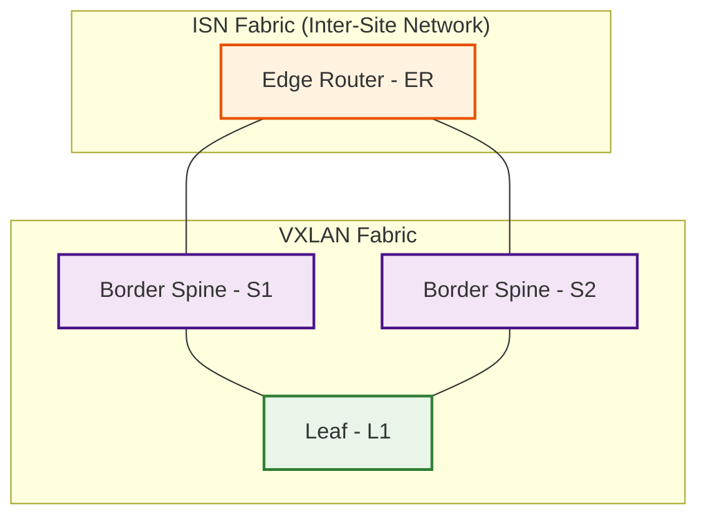

# Summary

Bringup a small VXLAN lab with Cisco Nexus Dashboard and Cisco Nexus9000v (n9kv)
using Ubuntu 24.04.2 LTS virtualization stack.

## Environment

This has been tested with the following.

- Cisco Nexus Dashboard
  - nd-dk9.3.2.1e.qcow2
- Cisco Nexus9000v
  - nexus9300v64.10.3.8.M.qcow2
- Ubuntu
  - 24.04.2 LTS
- Python
  - 3.13
  - The stock Python 3.12 on Ubuntu 24.04.2 LTS should also work
- Ansible
  - 2.18.7
- QEMU
  - qemu-system-x86_64 version 8.2.2
- OVMF (used for nk9v BIOS)
  - apt install ovmf
- [Cockpit](https://cockpit-project.org) (optional)
  - Version 343

NOTE: You'll need a Cisco account to download Nexus Dashboard and Nexus9000v images.

## Dependencies

### KVM Support

Check if KVM is supported. If this returns error(s) things are not going to work for you.

```bash
kvm-ok
```

### Python

I use Python 3.13, but the stock Python 3.12 on Ubuntu 24.04.2 LTS should be fine.

To install Python 3.13, do the following.  Add the deadsnakes PPA.
This PPA contains more recent Python versions packaged for Ubuntu.

```bash
sudo add-apt-repository ppa:deadsnakes/ppa
sudo apt update

# Install Python 3.13
sudo apt install python3.13

# Install additional packages, especially python3.13-venv which we use further below
sudo apt install python3.13-venv python3.13-dev
```

### Virtualization stack

You'll need the virtualization stack consisting of qemu and libvirt.
Install them as follows.

```bash
sudo apt update
sudo apt install qemu-kvm libvirt-daemon-system libvirt-clients bridge-utils virt-manager
```

If you don't want to run virsh and other virtualization commands as root, and you want
to run Virtual Machine Manager as a normal user (not root) add yourself to the libvirt
group.

```bash
# Run the following as a non-root user with sudo access.
sudo usermod -aG libvirt $USER
sudo usermod -aG kvm $USER
newgrp libvirt
sudo systemctl enable --now libvirtd

# Check libvirt status
sudo systemctl status libvirtd

# Assuming you've executed the above, you can run the virt-manager GUI (Virtual Machine Manager) as a normal user.
virt-manager
```

### OVMF

You'll need OVMF for the nexus9000v BIOS

```bash
sudo apt install ovmf
```

### Clone the n9kv-kvm repository

The scripts and environment vars in this repository assume it is cloned into
the following location.  You can, of course, put it wherever you want, but
will need to update everything to match your preferred location.

```bash
$HOME/repos/n9kv-kvm
```

```bash
mkdir $HOME/repos
cd $HOME/repos
git clone https://github.com/allenrobel/n9kv-kvm.git
cd n9kv-kvm
```

### Python virtual environment

So that this project's dependencies don't interfere with other projects,
it's recommended to create and activate a Python venv.

```bash
cd $HOME/repos/n9kv-kvm
python3.13 -m venv .venv
source $HOME/repos/n9kv-kvm/.venv/bin/activate
```

### Upgrade pip and install uv

```bash
source $HOME/repos/n9kv-kvm/.venv/bin/activate
pip install --upgrade pip
pip install uv
```

If you see a message similar to the below, check your PYTHONPATH and
ensure that `$HOME/repos/n9kv-kvm/.venv` is the first entry.

```bash
  Attempting uninstall: pip
    Found existing installation: pip 24.0
    Not uninstalling pip at /home/arobel/py311/lib/python3.11/site-packages, outside environment /home/arobel/repos/n9kv-kvm/.venv
    Can't uninstall 'pip'. No files were found to uninstall.

```

For example, PYTHONPATH should look like below (at least the first entry).

```bash
(.venv) arobel@cvd-3:~/repos/n9kv-kvm$ echo $PYTHONPATH
/home/arobel/repos/n9kv-kvm/.venv
(.venv) arobel@cvd-3:~/repos/n9kv-kvm$
```

If it doesn't, then do the following:

```bash
export PYTHONPATH=$HOME/repos/n9kv-kvm/.venv:$PYTHONPATH
# And try to upgrade pip and install uv again
source $HOME/repos/n9kv-kvm/.venv/bin/activate
pip install --upgrade pip
pip install uv
```

### uv sync

To install dependencies used in this repository, including ansible,
run the following.

```bash
source $HOME/repos/n9kv-kvm/.venv/bin/activate
cd $HOME/repos/n9kv-kvm
uv sync
```

### Test the environment

Test ansible-playbook to see if it's properly installed

```bash
source $HOME/repos/n9kv-kvm/.venv/bin/activate
ansible-playbook --version
# whereis should show $HOME/repos/n9kv-kvm/.venv/bin/ansible-playbook
whereis ansible-playbook
```

If ansible-playbook shows a different path, then your `PYTHONPATH` environment
variable contains a path to a different `ansible-playbook` that is overriding
the local installation path.  This may be OK if you prefer to use the other
version.  Else, modify your `PYTHONPATH` accordingly, e.g.:

```bash
unset PYTHONPATH
export PYTHONPATH=$HOME/repos/n9kv-kvm/.venv:$PYTHONPATH
```

### Setup bridges

#### Configure qemu to allow the bridges used in this project

You may have to create the `/etc/qemu` directory first.

```bash
# Check if the directory exists
ls -ld /etc/qemu
# If it doesn't exist, create it.
sudo mkdir /etc/qemu
```

If `/etc/qemu/bridge.conf` already exists on your host, then append
the contents of `./config/bridges/bridge.conf` to your existing file.

```bash
# Check if /etc/qemu/bridge.conf exists
sudo cat /etc/qemu/bridge.conf
# If it does exist, append to it, rather than overwrite it.
sudo cat $HOME/repos/n9kv-kvm/config/bridges/bridge.conf >> /etc/qemu/bridge.conf
# Verify things look OK
sudo cat /etc/qemu/bridge.conf
```

It `/etc/qemu/bridge.conf` doesn't exist, create it.

```bash
sudo cp $HOME/repos/n9kv-kvm/config/bridges/bridge.conf /etc/qemu/bridge.conf
sudo chmod 600 /etc/qemu/bridge.conf
```

#### Configure netplan

Inspect and edit the following file to ensure it will work
for you.

```bash
$HOME/repos/n9kv-kvm/config/bridges/99-bridges.yaml
```

In particular, verify that:

- The physical interface exists. You'll likely need to change
  the interface name (`enp34s0f0` below) to match your host
  (see the `link` parameter for `Vlan11` and `Vlan12` below).
  To check your interfaces e.g. `ip link show`.
- Vlans 11 and 12 are not already associated with your
  interface (the `id` parameter for `Vlan11` and `Vlan12` below).
- The bridge names (e.g. `BR_ND_MGMT`, `BR_ER_S1`, etc) don't conflict
  with existing bridges on your host.
- The ip addresses (`192.168.11.1/24` and `192.168.12.1/24`) don't
  conflict with other addresses on your host, or with addresses in
  your network that your host needs to reach.

```yaml
  vlans:
    Vlan11:
      id: 11
      link: enp34s0f0
      optional: true
    Vlan12:
      id: 12
      link: enp34s0f0
      optional: true
```

Copy the bridges configuration into /etc/netplan.

```bash
cd $HOME/repos/n9kv-kvm/config/bridges
sudo cp ./99-bridges.yaml /etc/netplan
sudo chmod 600 /etc/netplan/99-bridges.yaml
```

Apply the bridges configuration

```bash
netplan try
netplan apply
```

If the above commands result in a warning like below:

```bash
** (process:37526): WARNING **: 18:03:28.923: Permissions for /etc/netplan/00-installer-config.yaml are too open. Netplan configuration should NOT be accessible by others.
```

Then modify the permissions of the files in `/etc/netplan` as follows
and try to apply the bridges configuration again.

```bash
sudo chown root /etc/netplan/*
sudo chmod 600 /etc/netplan/*
```

If the above commands result in messages like the following, you can ignore them.

```bash
(.venv) arobel@cvd-3:~/repos/n9kv-kvm/config/bridges$ sudo netplan try
BR_ER_S2: reverting custom parameters for bridges and bonds is not supported
BR_ER_S1: reverting custom parameters for bridges and bonds is not supported
BR_ND_DATA: reverting custom parameters for bridges and bonds is not supported
BR_ND_MGMT: reverting custom parameters for bridges and bonds is not supported
BR_S2_L1: reverting custom parameters for bridges and bonds is not supported
br0: reverting custom parameters for bridges and bonds is not supported
BR_S1_L1: reverting custom parameters for bridges and bonds is not supported

Please carefully review the configuration and use 'netplan apply' directly.
```

Verify netplan was applied correctly.

- ip link show type bridge | grep BR_

Some bridges will be DOWN. This is expected and we'll fix it later.

```bash
(.venv) arobel@cvd-3:~/repos/n9kv-kvm/config/bridges$ ip link show type bridge | grep BR_
10: BR_ER_S1: <NO-CARRIER,BROADCAST,MULTICAST,UP> mtu 9216 qdisc noqueue state DOWN mode DEFAULT group default qlen 1000
11: BR_ER_S2: <NO-CARRIER,BROADCAST,MULTICAST,UP> mtu 9216 qdisc noqueue state DOWN mode DEFAULT group default qlen 1000
12: BR_ND_DATA: <BROADCAST,MULTICAST,UP,LOWER_UP> mtu 1500 qdisc noqueue state UP mode DEFAULT group default qlen 1000
13: BR_ND_MGMT: <BROADCAST,MULTICAST,UP,LOWER_UP> mtu 1500 qdisc noqueue state UP mode DEFAULT group default qlen 1000
14: BR_S1_L1: <NO-CARRIER,BROADCAST,MULTICAST,UP> mtu 9216 qdisc noqueue state DOWN mode DEFAULT group default qlen 1000
15: BR_S2_L1: <NO-CARRIER,BROADCAST,MULTICAST,UP> mtu 9216 qdisc noqueue state DOWN mode DEFAULT group default qlen 1000
(.venv) arobel@cvd-3:~/repos/n9kv-kvm/config/bridges$
```

## Install Nexus Dashboard (ND)

Edit one of the `nd_qemu_*.sh` files (e.g. `nd_qemu_321e.sh`) to suit your
environment e.g. the ND image path and name.  Note the `ND_NAME` setting
in this file.  This is what you will console to below.

Also, take note of disk space requirements.  The ND qcow2 images
range from 15.9GB (321e) to 16.4GB (4.1 EFT), so ensure your
`ND_SOURCE_DIR` (see below) has at least this much space.

Also note that `ND_INSTALL_DIR` (see below) needs to have enough
space to hold both of the created disk1 and disk2 files.  With
ND 4.1, and a very minimal configuration, this is 50GB, but these
disks are configured to grow to 500GB (e.g. ND hosts n9kv images
which will grow the size of disk2 as you upload these images to ND),
so plan accordingly based on your estimated usage.

```bash
ND_SOURCE_DIR=/iso/nd         # The directory containing ND_IMAGE
ND_IMAGE=nd-dk9.3.2.1e.qcow2  # The ND image name
ND_INSTALL_DIR=/iso/nd/321e   # Where to create ND disk1 and disk2
ND_MGMT_NET=BR_ND_MGMT        # Bridge for ND's management network
ND_DATA_NET=BR_ND_DATA        # Bridge for ND's data network
ND_NAME=nd_321e               # Name of ND instance (use for console below)
```

Below are current sizes in a newly-installed ND 4.1 EFT setup.

```bash
arobel@cvd-2:~$ ls -l /iso/nd/4.1.0.156b/running
total 47226124
-rw-r--r-- 1 libvirt-qemu kvm  1349058560 Jul 27 18:47 nd-node1-disk1.qcow2
-rw-r--r-- 1 libvirt-qemu kvm 47009562624 Jul 27 18:47 nd-node1-disk2.qcow2
arobel@cvd-2:~$
```

Once you've reviewed and modified the ND setup script, run it and connect
to the virsh console to finish the ND setup.

```bash
cd $HOME/repos/n9kv-kvm/config/qemu
sudo ./nd_qemu_321e.sh
virsh console nd_321e
```

After connecting to the virsh console, give the setup some time
(5 to 10 minutes) and you'll eventually see something similar to
the output below.

Press return and answer the questions for Admin Password,
Management Network IP Address/Mask, and Cluster Leader (answer
Y to cluster leader since we are using a single node setup).

You'll use an address within `Vlan11` connected to `BR_ND_MGMT`
for Management Network IP Address/Mask.  See the preceeding section
`Configure netplan` to configure `Vlan11` and the bridges.

```bash
Press any key to run first-boot setup on this console...

Fri Jul 25 02:22:46 UTC 2025: Starting Nexus Dashboard setup utility
Welcome to Nexus Dashboard 4.1.0.156b 
Press Enter to manually bootstrap your node...
Admin Password: 
Reenter Admin Password: 
Management Network: 
  IP Address/Mask: 192.168.11.2/24
Is Cluster Leader? Note: only one node in the cluster must be leader. (Y/n): Y
Please review the config
Cluster Leader: true
Management Network:
  Gateway: 192.168.11.1
  IP Address/Mask: 192.168.11.2/24

Re-enter config?(y/N): N

System configured successfully
Initializing System on first boot. Please wait..
Fri Jul 25 02:24:29 UTC 2025: Nexus Dashboard setup complete.

<skip stuff...>

Nexus Dashboard localhost ttyS0

Nexus Dashboard (4.1.0.156b): system initialized successfully
Please wait for system to boot : [########################################] 100%
System up, please wait for UI to be online.

System UI online, please login to https://192.168.11.2 to continue.
```

Use a web browser to finish the ND configuration. ND provides screens
to configure at least three "persistent IPs" which are used for services
provided by ND, including DHCP and POAP.  I prefer using the lower range
of IPs in each of Vlan11 and Vlan12 for these e.g.:

- Vlan11
  - 192.168.11.10
  - 192.168.11.11
  - 192.168.11.12
- Vlan12
  - 192.168.12.10
  - 192.168.12.11
  - 192.168.12.12

This leaves the upper range of addresses for n9kv mgmt0 addresses,
client/server VMs, etc.

## Nexus 9000v (n9kv) configuration and startup

We will be using an Ansible playbook to generate the n9kv startup-config
ISO files.

- $HOME/repos/n9kv-kvm/config/ansible/startup_config_iso.yaml

This script uses a Jinja2 template to create the configs.

- $HOME/repos/n9kv-kvm/config/ansible/nxos_startup_config.j2

It then creates the ISO file, containing the startup-config
(renamed to nxos_config.txt), that n9kv will read as its
startup configuration.

### Edit the Jinja2 template

Have a look at the template and make any desired edits.

- $HOME/repos/n9kv-kvm/config/ansible/nxos_startup_config.j2

The template currently contains a very minimal startup config
containing (e.g. for the edge router, ER):

```bash
configure terminal
hostname ER
boot nxos bootflash:/nexus-cs-10.3.8M.bin

interface mgmt0
  no cdp enable
  vrf member management
  ip address 192.168.11.111/24
  no shutdown
```

Several items above are derived from variables located in
two places, as shown below:

- hostname : $HOME/repos/n9kv-kvm/config/ansible/dynamic_inventory.py (ER_HOSTNAME)
- boot nxos : $HOME/repos/n9kv-kvm/config/ansible/startup_config_iso.yaml (boot_image var)
- ip address : $HOME/repos/n9kv-kvm/config/ansible/dynamic_inventory.py (ER_IP4)

### Edit the startup_config_iso.yaml playbook

The `vars` section of this playbook contains the following items
that need to be modified for your environment.  The other items
in the `vars` section are populated based on the contents of
`$HOME/repos/n9kv-kvm/config/ansible/dynamic_inventory.py`

```yaml
  vars:
    boot_image: "nexus-cs-10.3.8M.bin"
    output_dir: "/iso/nxos/config"
```

- boot_image - Set this to the image name (.bin) that is extracted from the n9kv `.qcow2` during bootup.
- output_dir - Set this to the location the n9kv startup config ISOs will be written to.

### Run the Ansible script

```bash
cd $HOME/repos/n9kv-kvm/config/ansible
source $HOME/repos/n9kv-kvm/.venv/bin/activate
ansible-playbook startup_config_iso.yaml -i dynamic_inventory.py
```

### Verify the ISO images are created

Substitute the path below with the `output_dir` from above.

```bash
ls -l 

## Topology built by this repository

- Two fabrics
  - ISN (inter-site network)
    - 1x Edge Router (ER)
  - VXLAN (VxLAN)
    - 2x Border Spines (S1, S2)
    - 1x Leaf (L1)



## Project Structure

```bash
(n9kv-kvm) arobel@Allen-M4 n9kv-kvm % tree
.
├── cockpit
│   ├── cockpit.png
│   ├── README.md
│   └── usr
│       ├── local
│       │   └── bin
│       │       ├── nexus9000v_monitor.py
│       │       ├── nexus9000v-monitor.service
│       │       ├── nexus9000v-monitor.timer
│       │       └── README.md
│       └── share
│           └── cockpit
│               └── nexus9000v
│                   ├── index.html
│                   ├── manifest.json
│                   ├── nexus-monitor-dark-theme.css
│                   ├── nexus-monitor-light-theme.css
│                   ├── nexus-monitor.css
│                   ├── nexus-monitor.js
│                   └── README.md
├── config
│   ├── ansible
│   │   ├── dynamic_inventory.py
│   │   ├── interface_mac_addresses_ER.yaml
│   │   ├── interface_mac_addresses_L1.yaml
│   │   ├── interface_mac_addresses_S1.yaml
│   │   ├── interface_mac_addresses_S2.yaml
│   │   ├── nxos_startup_config.j2
│   │   └── startup_config_iso.yaml
│   ├── bridges
│   │   ├── 99-bridges.yaml
│   │   ├── bridge.conf
│   │   ├── bridges_config.sh
│   │   ├── bridges_down.sh
│   │   └── bridges_monitor.sh
│   └── qemu
│       ├── n9kv_qemu_ER_cdrom.sh
│       ├── n9kv_qemu_ER.sh
│       ├── n9kv_qemu_L1.sh
│       ├── n9kv_qemu_S1.sh
│       ├── n9kv_qemu_S2.sh
│       ├── nd_qemu_321e.sh
│       └── nd_qemu_EFT.sh
├── env
│   ├── env_ansible.sh
│   ├── env_libvirt.sh
│   └── env_python.sh
├── monitor
│   └── show_nd_interfaces
├── pyproject.toml
├── README.md
└── uv.lock

14 directories, 39 files
(n9kv-kvm) arobel@Allen-M4 n9kv-kvm %
```
