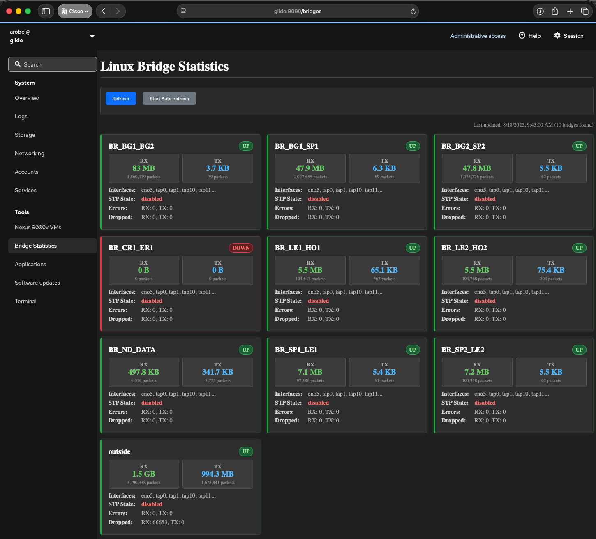

# Linux Bridge Statistics Monitor

A Cockpit web interface for monitoring Linux bridge statistics, including RX/TX packet counts, byte counts, errors, and dropped packets.

## Features

- Real-time monitoring of all Linux bridges on the system
- RX/TX statistics with human-readable byte formatting
- Interface listing for each bridge
- STP (Spanning Tree Protocol) state monitoring
- Auto-refresh functionality
- Error and dropped packet monitoring

## Installation

### 1. Copy the files to the appropriate directories

```bash
sudo cp -r usr/share/cockpit/bridges /usr/share/cockpit/
sudo cp usr/local/bin/bridge_monitor.py /usr/local/bin/
sudo chmod +x /usr/local/bin/bridge_monitor.py
sudo cp usr/local/bin/bridge-monitor.service /etc/systemd/system/
sudo cp usr/local/bin/bridge-monitor.timer /etc/systemd/system/
```

### 2. Enable and start the systemd timer

```bash
sudo systemctl daemon-reload
sudo systemctl enable bridge-monitor.timer
sudo systemctl start bridge-monitor.timer
```

### 3. Restart Cockpit

```bash
sudo systemctl restart cockpit
```

### 4. Access the Bridge Statistics page in Cockpit

`https://your-server:9090`

### 4. Check the service status

```bash
sudo systemctl status bridge-monitor.timer
sudo systemctl status bridge-monitor.service
```

## Command Line Usage

The bridge monitor can also be used from the command line:

```bash
# Show all bridges in table format
/usr/local/bin/bridge_monitor.py --table

# Show specific bridge
/usr/local/bin/bridge_monitor.py --bridge BR_LE1_HO1 --table

# Output JSON for scripting
/usr/local/bin/bridge_monitor.py --json
```

## Statistics Collected

For each bridge, the monitor collects the following.

- **Name**: Bridge interface name
- **Status**: UP/DOWN state
- **RX Statistics**: Bytes, packets, errors, dropped
- **TX Statistics**: Bytes, packets, errors, dropped
- **Interfaces**: List of attached interfaces
- **STP State**: Spanning Tree Protocol enabled/disabled

## Data Sources

The monitor uses standard Linux networking tools

- `ip -s link show` for interface statistics
- `bridge link` for bridge topology
- `/sys/class/net/*/bridge/` for STP state
- `/sys/class/net/*/brif/` for interface listing

## Requirements

- Python 3.8+
- Linux with bridge-utils
- Cockpit web console (typically included with Ubuntu Server 24.04.2 LTS)
- Root or appropriate permissions for network monitoring

## Files

- `bridge_monitor.py` - Python backend script
- `index.html` - Main web interface
- `bridge-monitor.js` - JavaScript frontend logic
- `bridge-monitor.css` - Styling
- `manifest.json` - Cockpit module manifest

## End Result

In the end, you'll have something in Cockpit that looks like below.
Nexus 9000v are added and removed dynamically as you create and destroy
them so, once setup, it's pretty low maintenance.


