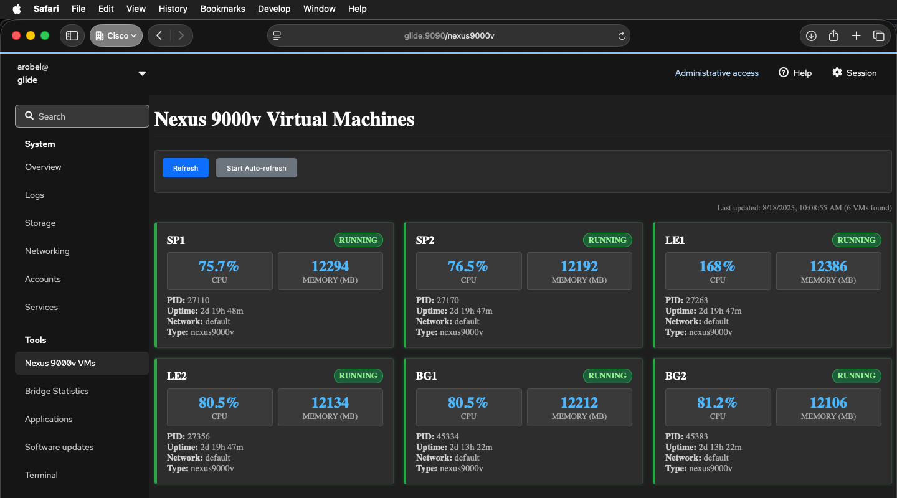

# Nexus9000v Monitoring with Cockpit

[Cockpit](https://cockpit-project.org) is a web-based graphical interface for
managing and monitoring networked devices.  It's completely optional so, if it's not
your thing, feel free to ignore this section.

Cockpit typically comes pre-installed with Ubuntu Server 24.04.2 LTS.  You can
check if it is installed on your server by accessing the following URL (replace
your_server with your server's IP or hostname...)

`https://your-server:9090`

The files in this directory include:

1. Backend Python script to collect/display Nexus 9000v status
2. Frontend Javascript and css files to add a Nexus 9000v VMs page to Cockpit
3. systemd service files to enable persistent monitoring

To install, follow the links below.

[Install the Backend Script and Service Files](./usr/local/bin/README.md)

[Install the Frontend JavaScript Support files (CSS, HTMP)](./usr/share/cockpit/nexus9000v/README.md)

In the end, you'll have something in Cockpit that looks like below.
Nexus 9000v are added and removed dynamically as you create and destroy
them so, once setup, it's pretty low maintenance.

