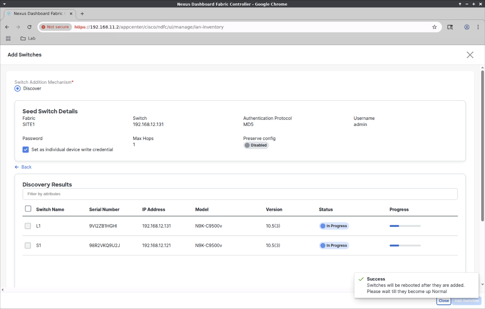
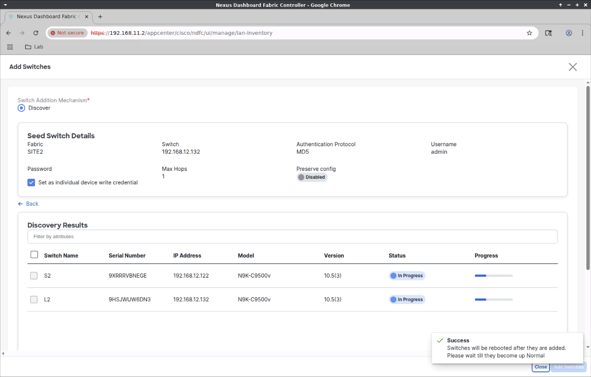
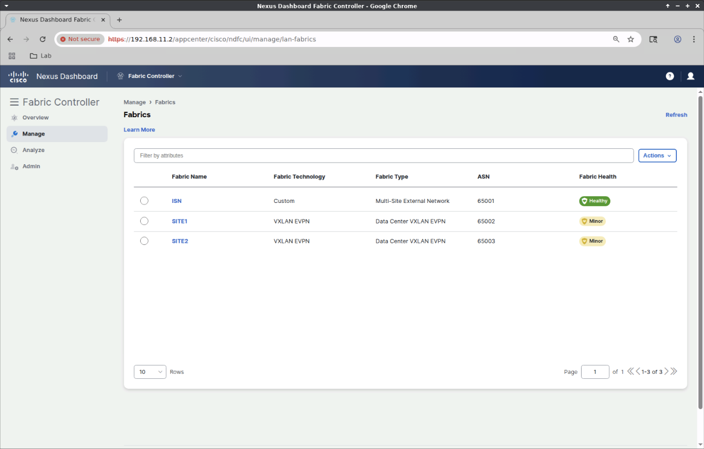

# Add Switches to Fabrics ND 3.2

NOTE: This section is out of date!

## 9. Inventory Screen (SITE1 Fabric Switches)

- Click `Add Switches`


## 10. Pick a Fabric Screen (SITE1 Fabric switches)

- Click `Choose Fabric`


## 11. Select Fabric Screen (SITE1 Fabric switches)

- Select the SITE1 fabric
- Click `Select`


## 12. Seed Switch Details Screen (SITE1 Fabric switches)

- `Seed IP` 192.168.12.141
- `Username` admin
- `Password` whatever you set when bringup up the nexus9000v switches
- `Max Hops` 1 (default of 2 will work, but 1 reduces the discovery time`
- `Set as individual device write credential` Enable
- `Preserve Config` disable (important!!!)
- Click `Discover Switches`


## 13. Warning Dialog

- Click `Confirm`


## 14. Discovery Results Screen

- Select switches (BG1, SP1, LE1)
- Click `Add Switches`


The switches will be rebooted.



## 15. Wait

- Wait for the switches to be added.
- Click `Close`


## 16. Inventory Screen (SITE2 Fabric Switches)

- Click `Add Switches`


## 17. Pick a Fabric Screen (SITE2 switches)

- Click `Choose Fabric`


## 18. Select Fabric Screen (SITE2 switches)

- Select the SITE2 fabric
- Click `Select`


## 19. Seed Switch Details Screen (SITE2 switches)

- `Seed IP` 192.168.12.142
- `Username` admin
- `Password` whatever you set when bringing up the nexus9000v switches
- `Max Hops` 1 (default of 2 will work, but 1 reduces the discovery time`
- `Set as individual device write credential` Enable
- `Preserve Config` disable (important!!!)
- Click `Discover Switches`


## 20. Warning Dialog (SITE2 switches)

- Click `Confirm`


## 21. Discovery Results Screen (SITE2 switches)

- Select switches (BG2, SP2, LE2)
- Click `Add Switches`


The switches will be rebooted.



- Wait for the switches to be added.
- Click `Close`


## 22. Wait for Discovery Column to display OK for all switches

It will take time (15-30 minutes) for the switches to finish rebooting.

Click Refresh occasionally to avoid being logged out due to inactivity.

Once all switches display OK, we can continue.


## 23. Change Switch Roles

We'll now change the roles of the switches.

- BG1 (Border Gateway)
- BG2 (Border Gateway)
- SP1 (Spine)
- SP2 (Spine)
- LE1 (Leaf)
- LE2 (Leaf)

## 24. Border Gateway Switch Role

- Select the BG1 and BG2 switches
- Click Actions -> Set Role

## 25. Select Role Dialog (Border Gateway Switches)

- Select `Border Gateway`
- Click `Select`

## 26. Border Spine Switch Role

- Select the SP1 and SP2 switches
- Click Actions -> Set Role

## 27 Select Role Dialog (Spine Switches)

- Select `Spine`
- Click `Select`

## 28. Warning Dialog (Spine Switches)

- Read and acknowledge the warning.  Click `OK`
- We will Recalculate and Deploy later.


## 29. Leaf Switch Role

- Select the LE1, LE2 switches
- Click Actions -> Set Role


## 30. Select Role Dialog (Leaf Switches)

- Select `Leaf`
- Click `Select`


## 31. Warning Dialog (Leaf Switches)

- Read and acknowledge the warning.  Click `OK`
- We will Recalculate and Deploy later.


## 32. Wait (for reachability)

Wait for all switches to become reachable (Discovery Status column will display `OK`).

This will take time (15-30 minutes) as the BG1, BG2, SP1, SP2, LE1, LE2 switches reboot.

Click `Refresh` occasionally to avoid being logged out due to inactivity...


## 33. All Switches Are Ready

NOTE: image is out of date...


## 34. Manage Fabrics

- Click `Manage -> Fabrics`

## 35. SITE1 Fabric

- In the Fabric Name column, double-click the blue `SITE1` name



## 36. Recalculate and Deploy - SITE1

- Click the blue Actions dropdown and select `Recalculate and Deploy`


## 37. Wait for switch configs to be built


## 38. Deploy Configuration - SITE1

- Click `Deploy All`


## 39. Wait

- Wait for the deployment to finish


## 40. Ignore Error on Switch consoles

On the switch consoles, during deployment, you'll see the following, which you can ignore.

```bash
2025 Aug  2 03:25:39 L1 %$ VDC-1 %$ nve[28908]: 'feature nve overlay' requires 'application leaf engine' (ALE) 1 or above based line cards. Please consult documentation
```

- Click `Close`


## 41. Fabric Overview - SITE1 (close the window)

- Click the `X` at the upper-right of the winder to close it.


## Fabrics (SITE2)

Perform steps 34-41 for the SITE2 fabric.

## Recalculate and Deploy

Perform a Recalculate and Deploy in the fabrics in the following order.

- SITE1
  - This establishes BGP peering between
    - BG1 and SP1
    - SP1 and LE1
- SITE2
  - This establishes BGP peering between
    - BG2 and SP2
    - SP2 and LE2
- MSD
  - This establishes BGP peering between
    - BG1 and BG2
