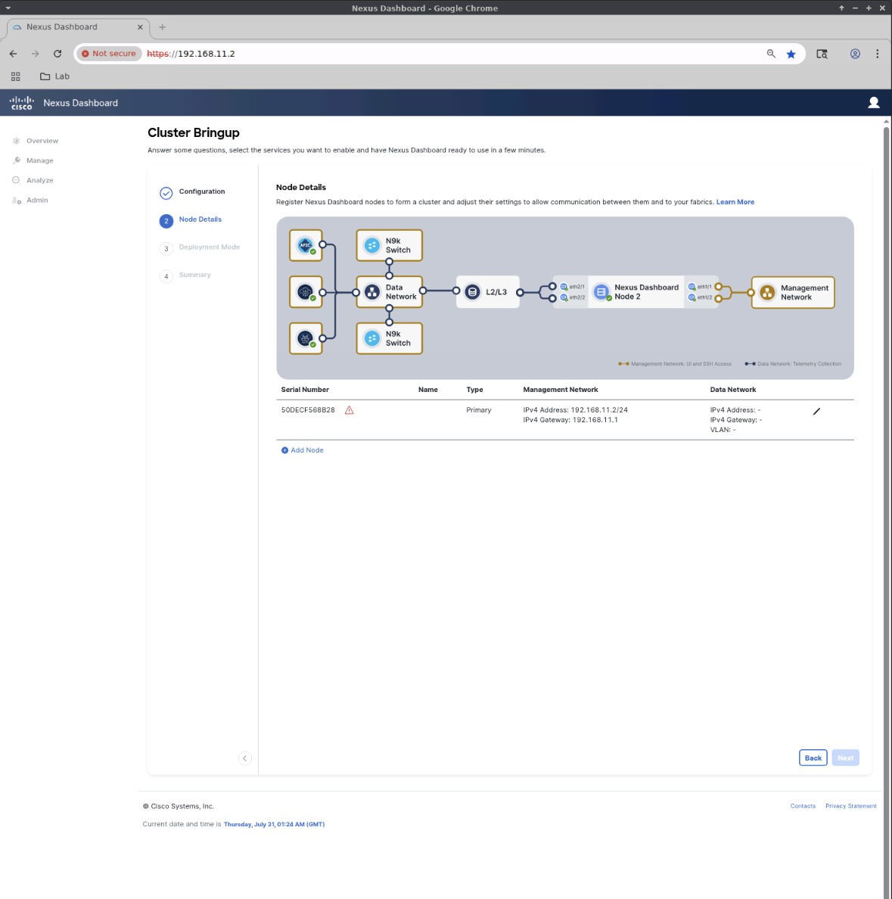
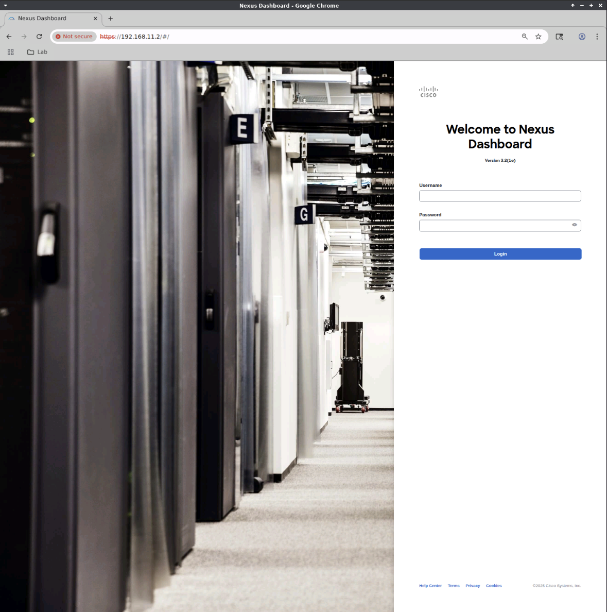

# ND 3.2 Bringup Web Phase

Once the CLI phase of the setup is complete, you will be asked to
point your browser to https://192.168.11.2

The below steps start with first browser login.

## ND - Use a web browser to finish the configuration

## Login

Login using the credentials you provided during CLI bringup.

## Cluster Bringup Page

You'll land on the Custer Bringup page.

Provide the following information.

- `Nexus Dashboard Cluster Name` ND
- Click `Add DNS Provider`
  - Add 192.168.11.1
  - Click the checkmark to accept
- Click `Add NTP Host Name/IP Address`
  - Add 192.168.11.1
  - Click the checkmark to accept
- Click `Skip Proxy` and accept the warning.
- Click `Next`

## Node Details Page

- Click the Pencil icon to the right of the Data Network column in the Node Details section.
- This brings up the Edit Node page

## Edit Node Page

Provide the following information.

- `Name` ND1
- `IPv4 Address/Mask` 192.168.12.2/24
- `IPv4 Gateway` 192.168.12.1
- Click `Save`
- You're taken back to the Cluster Bringup page.

## Cluster Bringup Page 2

- Click `Next`

## Deployment Mode

On the Deployment Mode Page:

- Select Fabric Controller for Deployment Mode
- Click the `Add Persistent Service IPs/Pools` button.

## External Service IPs

On the `External Service IPs` page, click `Add Management Service IP Address`

Add the following addresses and click the checkmark after adding each to accept.

- Add 192.168.11.10
- Add 192.168.11.11
- Add 192.168.11.12

On the `External Service IPs` page, click `Add Data Service IP Address`

Add the following addresses and click the checkmark after adding each to accept.

- Add 192.168.12.10
- Add 192.168.12.11
- Add 192.168.12.12

Click `Save`

## Cluster Bringup Page 3

- Back on the `Cluster Bringup` page, click Next

## Summary Page

- On the `Summary` page, review the information for accuracy and click `Save`

## Accept Warning Popop

- Accept the warning by clicking `Continue`

## Progress Page

After about a minute, you'll see a progress page.

## Login

Wait for a couple hours for Nexus Dashboard's micro-services to be created and started.

Your browser will likely disconnect during this time.  Refresh the page after a few
minutes and you'll be presented with the login screen.

## Progress Page 2

Login and you'll be back at the progress page.

Again, wait until the system is fully up.

## Meet Nexus Dashboard

Once the system is up, you'll be presented with some informational
screens.  Click through these.

When ready, proceed to the
[NDFC application bringup section](https://github.com/allenrobel/n9kv-kvm/blob/main/docs/nd_installation.md#nd-32-broswer-based-fabric-controller-ndfc-bringup).

## ND - Access the documentation

The documentation is available on your ND instance.  Point your browser to:

https://192.168.11.2/#/helpCenter

## ND - Access the REST API documentation

Likewise, the REST API documentation is available directly from ND:

- https://192.168.11.2/apidocs/

There are two sets of API documentation.

- ND (this is what you see when accessing the URL above).
- NDFC (click on the Nexus Dashboard dropdown menu and select Nexus Dashboard Fabric Controller)
