# ND 4.1 Bringup Web Phase

## CLI phase complete

Once the CLI phase of the setup is complete, you will be asked to point your browser to https://192.168.11.2 and login.

```bash
Nexus Dashboard localhost ttyS0

Nexus Dashboard (4.1.0.156b): system initialized successfully
Please wait for system to boot : [########################################] 100%
System up, please wait for UI to be online.

System UI online, please login to https://192.168.11.2 to continue.
```

In the next phase of configuration, you'll configure the following:

- Cluster Name
- Cluster Type (LAN in our case)
- Node Basic Information
  - DNS provider
  - NTP hostname/IP address
  - Proxy server (since we're completely local to one host, we'll skip this)
- Cluster Connectivity
  - L2 or BGP (we'll use L2)
- Node Details
  - `Name` ND1
  - `Type` Primary
  - `Data network`
    - `IPv4 address` 192.168.12.2/24
    - `IPv4 gateway` 192.168.12.1
    - `Vlan` Not needed so leave as-is
- Persistent IP addresses for services on the ND DATA network (DHCP, POAP, etc)

## Journey Screen

Once you login, you'll see the `Journey` screen.

Under `2) Cluster Bringup` click `Go`

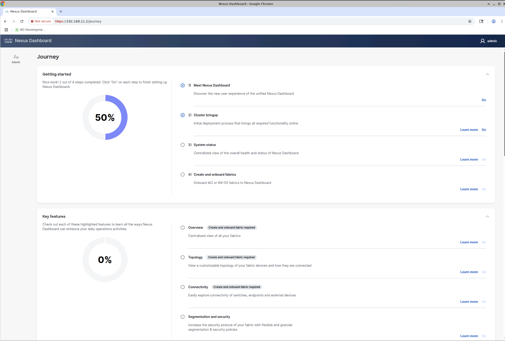

## Basic Information Screen

- `Cluster name` ND
- `LAN (default)` Be sure to click on this!!!  In my setup, SAN was selected by default.
- Click `Next`

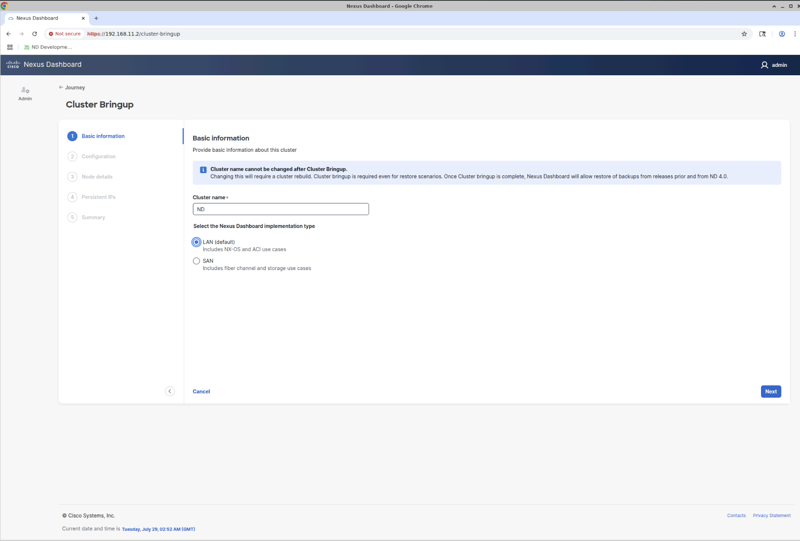

## Node Details Screen

- Click `Add DNS provider`, enter 192.168.11.1, and click the check box
- Click `Add NTP hostname/IP address`, enter 192.168.11.1, and click the check box
- Click `Skip Proxy` and `Confirm` to acknowledge the warning popup.
- Ignore `Advanced settings` which have to do with App and Service subnets used internally.
- Click `Next`

TODO: Add Node Details Screengrab...

## Node Details Cluster Connectivity Screen

- `Cluster connectivity` select L2
- At the far right of the screen (to the right of Configuration status `Incomplete`, click the pen icon
  - This brings up the `Edit Node` screen

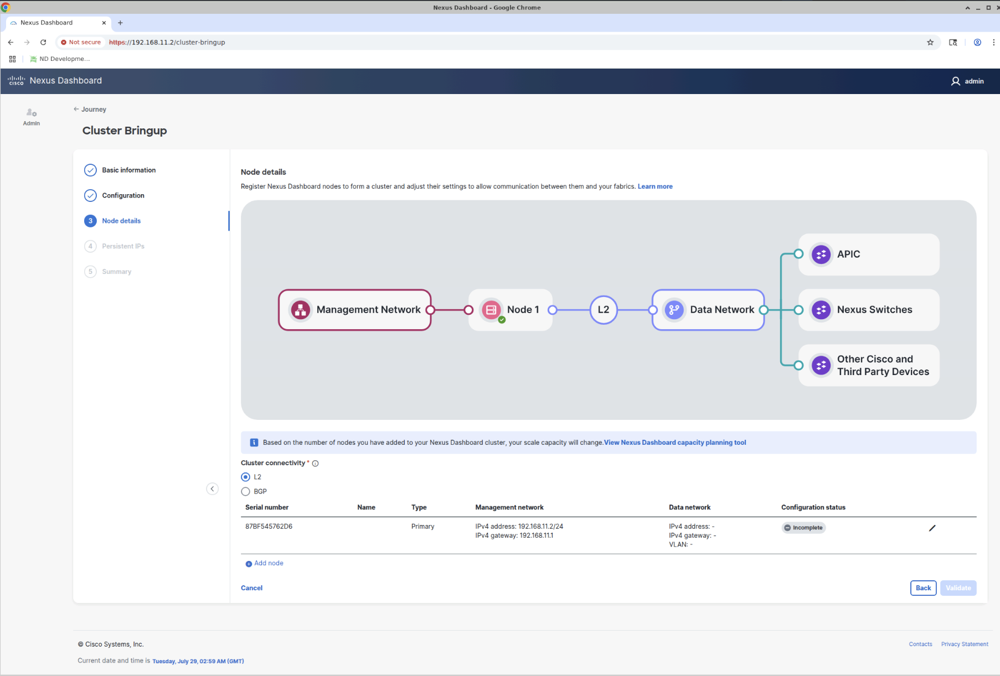

## Edit Node Screen

TODO: Add Edit Node screengrab...

The `Edit node` screen configures our single ND node.

- `Name` ND1
- `Type` Primary
- `Data network`
  - `IPv4 address` 192.168.12.2/24
  - `IPv4 gateway` 192.168.12.1
  - `Vlan` Not needed so leave as-is
- Click `Save`

Clicking `Save` takes you back to the previous screen, where Configuration status is now `Successful`

TODO: Add Edit Node Configuration Successful Screen

- Click `Validate`

Clicking `Validate` takes you to the `Persistent IPs` screen.

## Persistent IPs Screen

Enter a comma-separated list of three addresses within the 192.168.12.0/24 subnet.
I prefer addresses in the lower range for ND services, allowing the upper range to
hold nexus9000v and other VMs.

- `IPv4 Address(es)` 192.168.12.10,192.168.12.11,192.168.12.12
- Click the `Add IP Address(es)` button

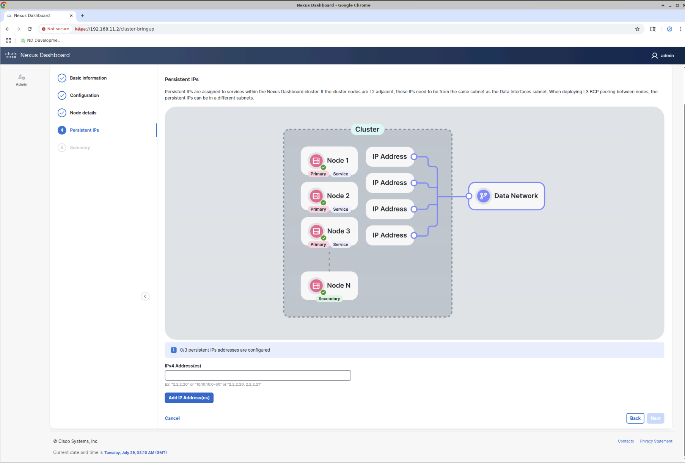

## Persistent IPs Added Screen

- Click `Next` after the IPs are added.

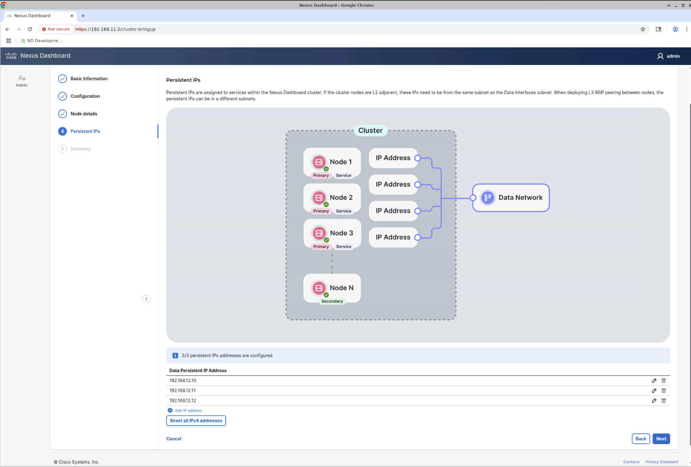

## Summary Screen

Clicking `Next` takes you to the Summary screen where you can review the configuration.

If everything looks OK, click `Save`

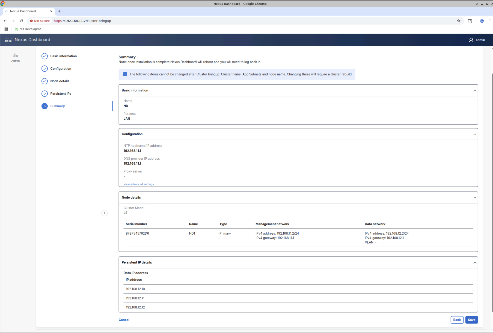

If you take too long on the Summary Screen, you may see the Cluster Bringup screen, but then get
kicked back to the Summary screen.  If you click Save again, you'll see the following error:

`Error Configuring Cluster: Pending cluster bootstrap exists - please cleanup and retry.`

If you see this, click the Reload button in your browser and you should see the
Cluster Bringup screen again.  Sigh!

Once the progress bar in the Cluster Bringup screen reaches 100%, ND will reboot and
you'll then wait for the login screen.

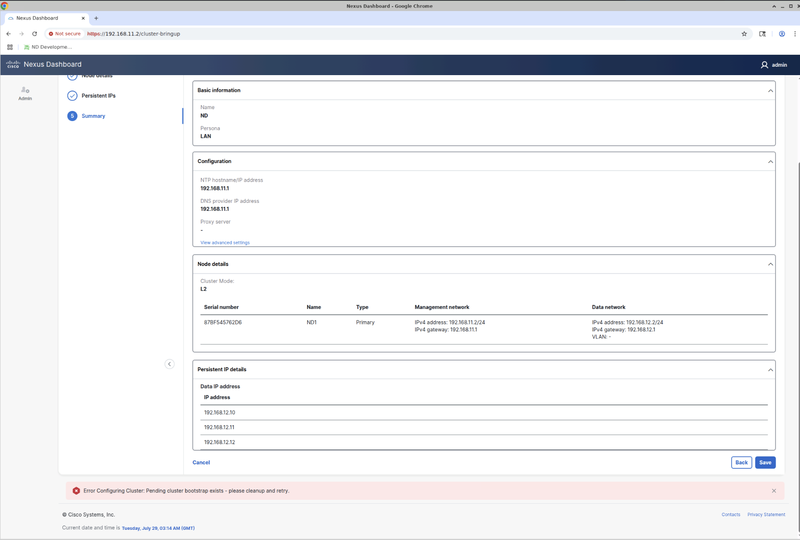

## Login Screen

- `Username` admin
- `Password` whatever you entered during the CLI bringup.

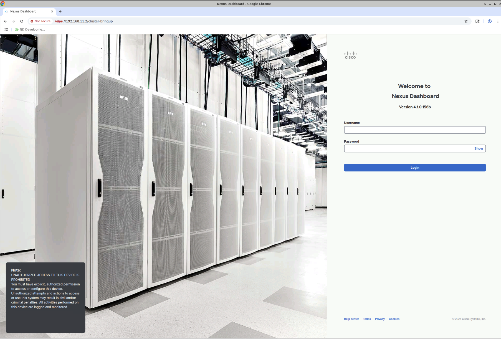

If you login immediately, you'll see something like this.

## Cluster Install Screen

Wait a very long time for everything to come up (couple hours).

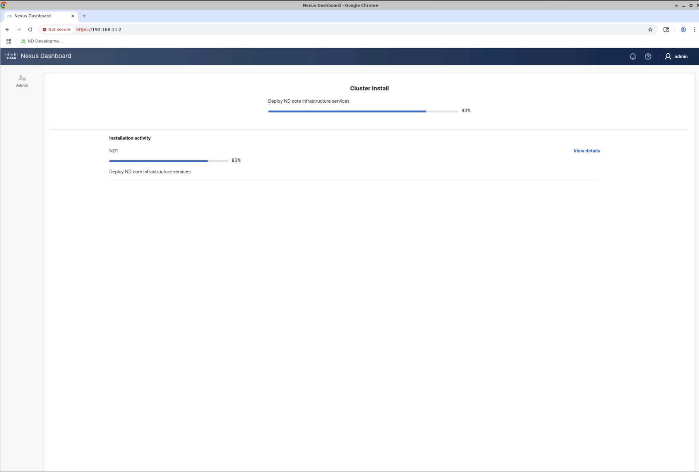

## System Software Screen

You'll see a screen similar to below at some point.

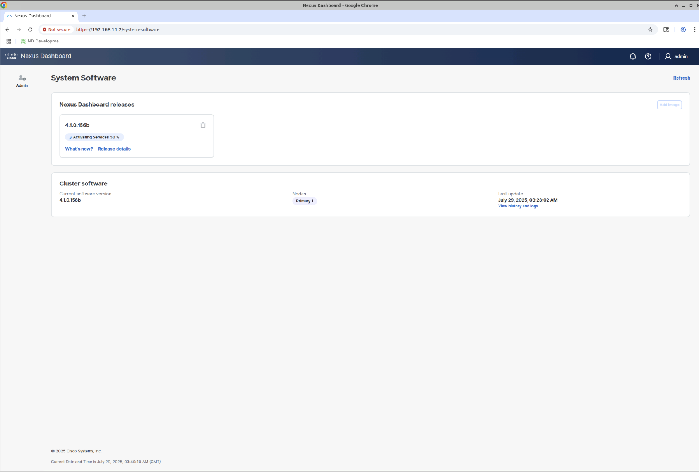

Clicking on `Release details` will show a detailed status of progress.

Clicking on `What's new?` shows a summary of new features in ND 4.1

## Release Details Screen

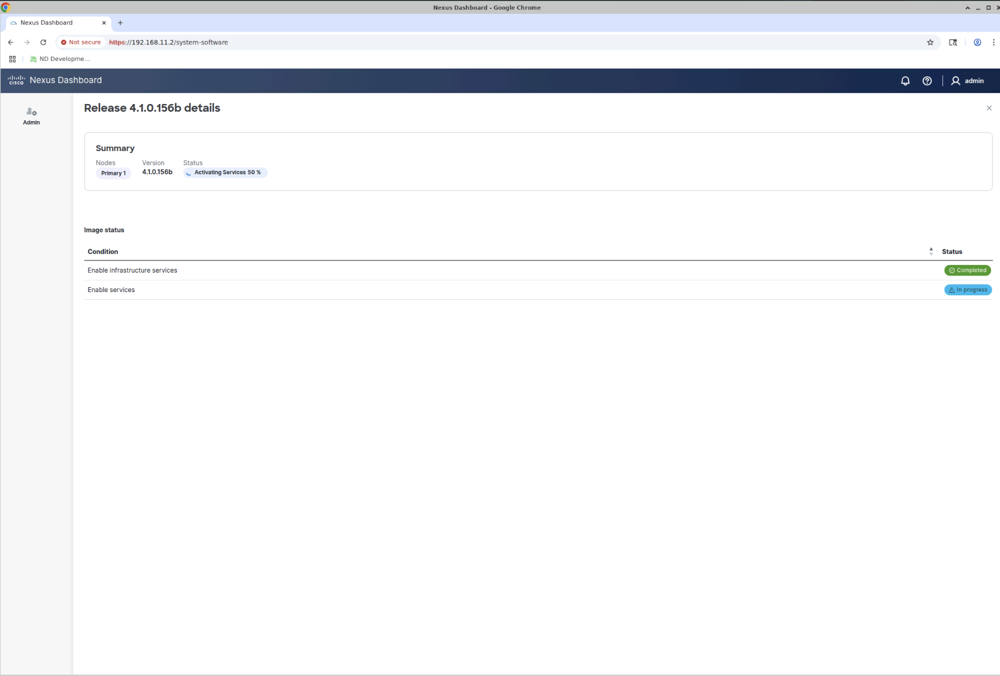

## What's New Screen

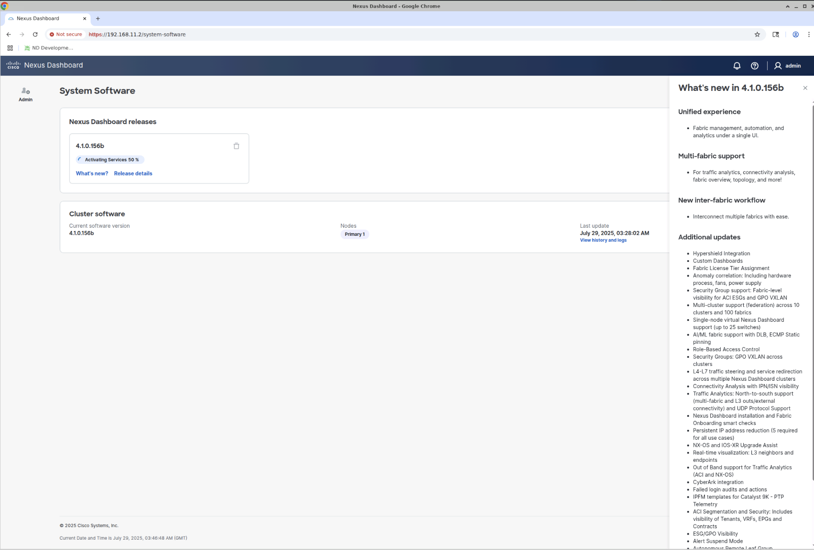

### ND - Access the documentation

The documentation is available on your ND instance.  Point your browser to:

https://192.168.11.2/#/helpCenter

### ND - Access the REST API documentation

Likewise, the REST API documentation is available directly from ND:

https://192.168.11.2/help-center/swagger
