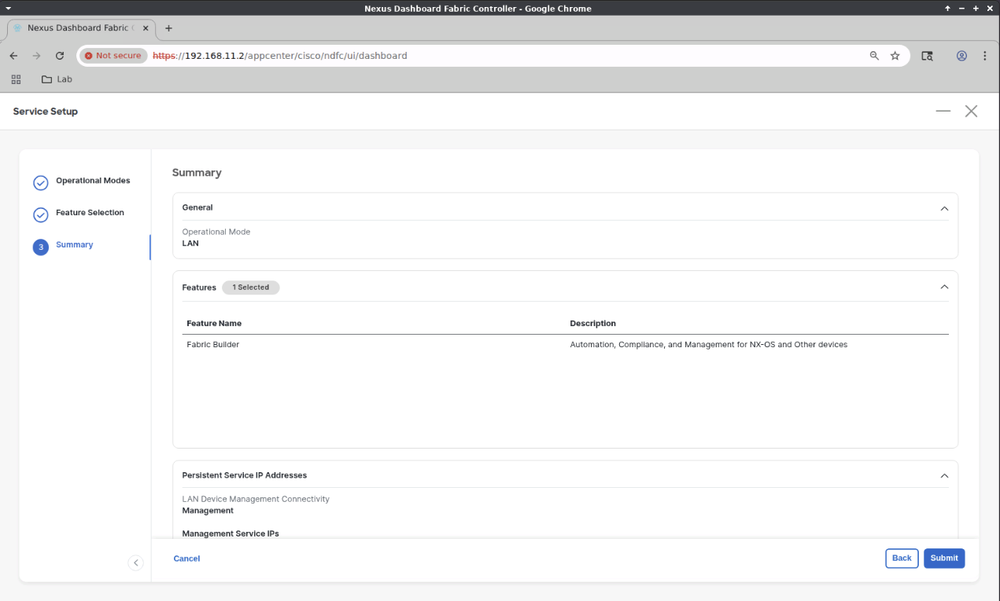

# NDFC Bringup

Nexus Dashboard 3.2 hosts other applications, such as Nexus Dashboard
Fabric Controller (NDFC).  Below, we'll perform the initial configuration
for NDFC.

## Login

When logging into Nexus Dashboard, you'll land on the Nexus Dashboard
journey screen.  We need first to configure NDFC.  To do this.

- Click the `Admin Console` dropdown menu and select `Fabric Controller`

## Introductory Screen

On first connection to the `Fabric Controller` application, you'll see an introductory screen.

- Optionally, click `No not show this message again.`
- Click `Get Started`

## Journey Screen

On the Journey screen, highlight Service Setup, and click `Go`

## Operational Modes Screen

On the `Operational Modes` screen:

- Click `LAN`
- Click `Next`

## Feature Selection Screen

On the `Feature Selection` screen

- Choose `Fabric Management Basic` for the lower memory footprint.
- Click `Next`

## Summary Screen

On the `Summary` screen,

- Review your choices
- Click `Submit`

## Controller Service Setup Screen

- Click `Back to Journey`

## Journey Screen Revisited

At this point, Fabric Controller is configuring and starting its services, so the side bar does not list all choices yet.

Wait some time, click `Refresh` in the upper-right corner of the page.

## Features Updated - Reload Page

You should see a message at the top of the page.

"Some features have been updated. Reload the page to see latest changes."

Rather than click `Refresh` here, the message is asking to reload your browser.

In Chrome, that's Ctrl+R, or click the reload icon to the left of the URL field.

## Introduction or Set Credentials

After reloading your browser, you may encounter the introductory screen again,
and/or a warning to set device credentials required for interacting with your
nexus9000v instances.   Depending whether the introduction is presented again,
and the order these are presented, one may be covered by the other.

So, perform the following in whatever order these dialogs are presented.

- Click `Set credentials` if the warning dialog is displayed.
- Check the `Do not show this message again.` box (optional), and click `Get Started`

OR

## LAN Credentials Management

Clicking `Set Credentials` will bring up the `LAN Credentials Management` screen.

- Click the blue `Set` button.

## Set Credentials Dialog

- `Username` nexus9000v username (most likely admin)
- `Password` nexus9000v password you plan to assign when bringing these up
- `Confirm Password`
- `Robot` check this since we're assuming this is just a lab with a single user.
- Click `Save`

## Success Dialog

- Click `OK`

NDFC is now configured.
